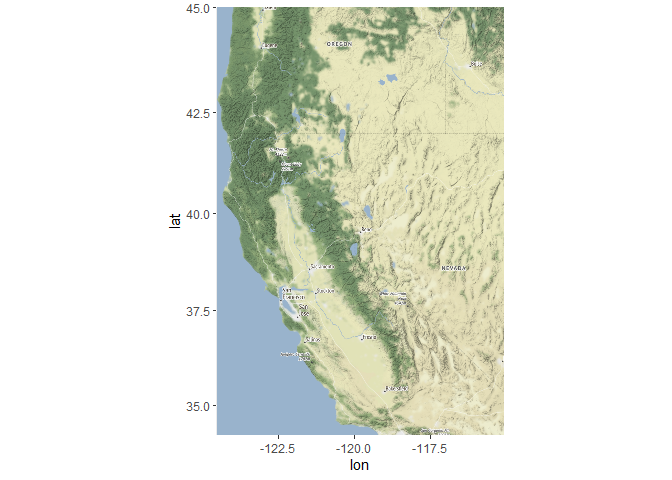
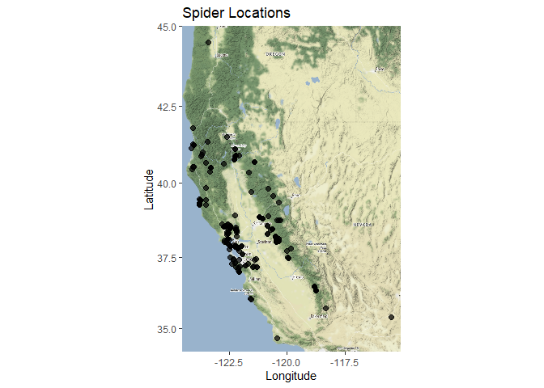
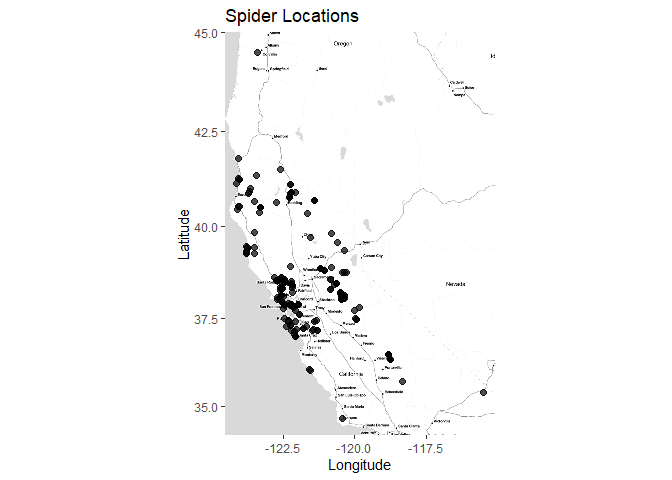
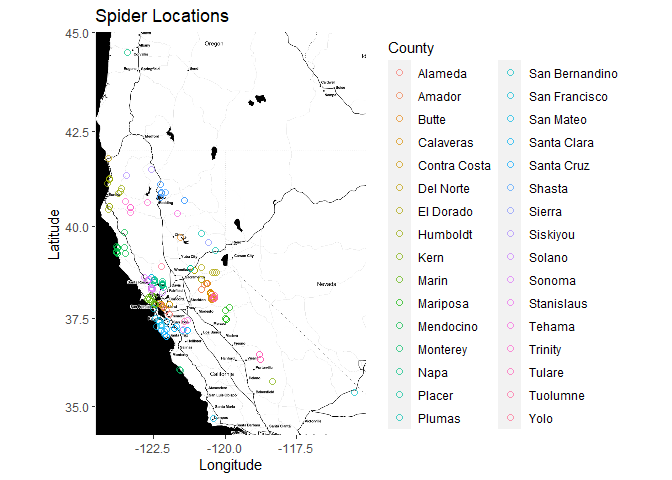
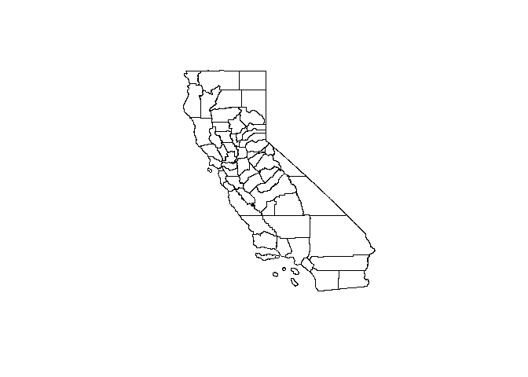
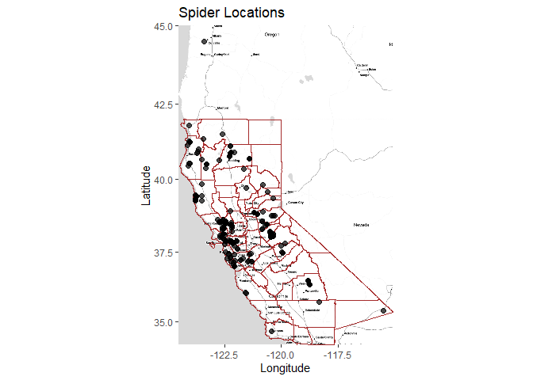
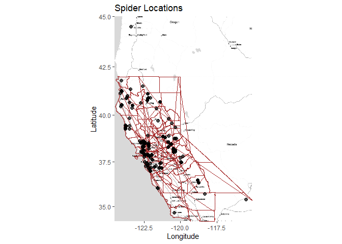

## Learning Goals
*At the end of this exercise, you will be able to:*  
1. Map spatial data in R.    
 
## Resources
[Overview of Cooordinate Reference Systems in R](https://www.nceas.ucsb.edu/~frazier/RSpatialGuides/OverviewCoordinateReferenceSystems.pdf)

## Spatial Data in R

There are many packages and techniques for working with spatial data in R. We will cover just some of the basics. One nice package is `ggmap`, which allows us to get base maps from Google Maps, OpenStreetMap, and Stamen Maps. It also works well with `ggplot2`. Let's install and load the development version of `ggmap` using `devtools`. We will also load the `tidyverse`.


```r
#install.packages("devtools")
library(devtools)
devtools::install_github("dkahle/ggmap")
```


```r
#install.packages("rgeos")
#install.packages("rgdal")
```


```r
library(ggmap)
library(tidyverse)
library(rgeos)
library(rgdal)
```

Let's also load our processed data from the first part of this lab.

```r
spiders <- read_csv("spiders_with_locs.csv")
```

## Create Base Map

Our goal here is to plot the spiders locations from the columns which contain the latitude and longitude. First, we need to get a base map for plotting our points on. We could plot them without a base map, but that wouldn't give us any context as to where they are in space. To get a base map we specify a min and max of each x and y coordinate, and create a bounding box. We set the bounding box to a little outside our min and max locations with `f = 0.05`. 


```r
spiders %>% 
  select(Latitude, Longitude) %>% 
  summary()
```

```
##     Latitude       Longitude     
##  Min.   :34.67   Min.   :-124.1  
##  1st Qu.:37.88   1st Qu.:-122.5  
##  Median :38.19   Median :-122.1  
##  Mean   :38.49   Mean   :-121.6  
##  3rd Qu.:38.88   3rd Qu.:-120.5  
##  Max.   :44.51   Max.   :-115.5
```


```r
lat <- c(34.67, 44.51)
long <- c(-124.1, -115.5)
bbox <- make_bbox(long, lat, f = 0.05)
```

Let's get a base map for our bounding box area. Google base maps require an API key and to enter credit card information. We will use the other non-google base maps for now.  

```r
b <- get_map(bbox, maptype = "terrain", source = "stamen")
```

```
## Map tiles by Stamen Design, under CC BY 3.0. Data by OpenStreetMap, under ODbL.
```

```r
ggmap(b)
```

<!-- -->

## Adding Points to Base Map

`ggmap` works well with `ggplot2`. To add our points we only need to specify the x and y location similar to how we made charts in previous labs. 

```r
ggmap(b) + 
  geom_point(data = spiders, aes(Longitude, Latitude), size = 2, alpha = 0.7) +
           labs(x = "Longitude", y = "Latitude", title = "Spider Locations")
```

<!-- -->


## Practice

Map the spider locations with a different type of basemap. What happens if you try to use a google source map? Experiment with different display options for the points. 


```r
b <- get_map(bbox, maptype = "toner-lite", source = "stamen")
```

```
## Map tiles by Stamen Design, under CC BY 3.0. Data by OpenStreetMap, under ODbL.
```

```r
ggmap(b) + 
  geom_point(data = spiders, aes(Longitude, Latitude), size = 2, alpha = 0.7) +
  labs(x = "Longitude", y = "Latitude", title = "Spider Locations")
```

<!-- -->


```r
g <- get_map(bbox, maptype = "toner-2010", source = "stamen")
```

```
## Map tiles by Stamen Design, under CC BY 3.0. Data by OpenStreetMap, under ODbL.
```

```r
ggmap(g) + 
  geom_point(data = spiders, aes(Longitude, Latitude,color=County), size = 2, alpha = 0.7,shape=1) +
  labs(x = "Longitude", y = "Latitude", title = "Spider Locations")
```

<!-- -->

## Shapefiles

In the data folder there is a file titled `CA_Counties_TIGER2016.shp`. This is a publicly available shapefile downloaded from the [California Open Data Portal](https://data.ca.gov/dataset/ca-geographic-boundaries). A shapefile is a format for storing polygon, line, or point information for use in ArcGIS or other mapping software including R. To load the shapefile we will need the `raster` and `sp` packages. We will read the file in as a shapefile and use `spTransform()` to tell R the projection is in lat/long. 

```r
#install.packages("raster")
#install.packages("sp")
library(raster)
```

```
## 
## Attaching package: 'raster'
```

```
## The following object is masked from 'package:dplyr':
## 
##     select
```

```
## The following object is masked from 'package:tidyr':
## 
##     extract
```

```r
library(sp)
#install.packages("rgdal")
library(rgdal)
```


```r
c <- shapefile("data/CA_counties/CA_Counties_TIGER2016.shp") %>% 
  spTransform(CRS("+proj=longlat +datum=WGS84"))
```

```
## Warning in OGRSpatialRef(dsn, layer, morphFromESRI = morphFromESRI, dumpSRS =
## dumpSRS, : Discarded ellps WGS 84 in Proj4 definition: +proj=merc +a=6378137
## +b=6378137 +lat_ts=0 +lon_0=0 +x_0=0 +y_0=0 +k=1 +units=m +nadgrids=@null
## +wktext +no_defs
```

```
## Warning in OGRSpatialRef(dsn, layer, morphFromESRI = morphFromESRI, dumpSRS =
## dumpSRS, : Discarded datum WGS_1984 in Proj4 definition: +proj=merc +a=6378137
## +b=6378137 +lat_ts=0 +lon_0=0 +x_0=0 +y_0=0 +k=1 +units=m +nadgrids=@null
## +wktext +no_defs
```

```
## Warning in showSRID(wkt2, "PROJ"): Discarded ellps WGS 84 in Proj4 definition:
## +proj=merc +a=6378137 +b=6378137 +lat_ts=0 +lon_0=0 +x_0=0 +y_0=0 +k=1 +units=m
## +nadgrids=@null +wktext +no_defs +type=crs
```

```
## Warning in showSRID(wkt2, "PROJ"): Discarded datum World Geodetic System 1984 in
## Proj4 definition
```

```r
class(c)
```

```
## [1] "SpatialPolygonsDataFrame"
## attr(,"package")
## [1] "sp"
```

```r
head(c)
```

```
##   STATEFP COUNTYFP COUNTYNS GEOID          NAME             NAMELSAD LSAD
## 0      06      091 00277310 06091        Sierra        Sierra County   06
## 1      06      067 00277298 06067    Sacramento    Sacramento County   06
## 2      06      083 00277306 06083 Santa Barbara Santa Barbara County   06
## 3      06      009 01675885 06009     Calaveras     Calaveras County   06
## 4      06      111 00277320 06111       Ventura       Ventura County   06
## 5      06      037 00277283 06037   Los Angeles   Los Angeles County   06
##   CLASSFP MTFCC CSAFP CBSAFP METDIVFP FUNCSTAT       ALAND     AWATER
## 0      H1 G4020  <NA>   <NA>     <NA>        A  2468694587   23299110
## 1      H1 G4020   472  40900     <NA>        A  2499183617   76073827
## 2      H1 G4020  <NA>  42200     <NA>        A  7084000598 2729814515
## 3      H1 G4020  <NA>   <NA>     <NA>        A  2641820834   43806026
## 4      H1 G4020   348  37100     <NA>        A  4773390489  945942791
## 5      H1 G4020   348  31080    31084        A 10510651024 1794730436
##      INTPTLAT     INTPTLON
## 0 +39.5769252 -120.5219926
## 1 +38.4500114 -121.3404409
## 2 +34.5370572 -120.0399729
## 3 +38.1838996 -120.5614415
## 4 +34.3587415 -119.1331432
## 5 +34.1963983 -118.2618616
```
  
The `shapefile()` function created a SpatialPolygonsDataFrame from our file. We can take a quick look at it with the base `plot()` function.

```r
plot(c)
```

<!-- -->

We want to convert the SpatialPolygonsDataFrame into a format we can use with `ggplot2`. To do this we will use the function `tidy()` from the `broom` package in the `tidyverse`. `tidy()` has a method for SpatialPolygonsDataFrame, we just need to tell it which column corresponds to the county. We can access the data in the counties layer with the `@data` command. 

```r
#install.packages("maptools")
library("maptools")
```

```
## Checking rgeos availability: TRUE
```

```r
head(c@data)
```

```
##   STATEFP COUNTYFP COUNTYNS GEOID          NAME             NAMELSAD LSAD
## 0      06      091 00277310 06091        Sierra        Sierra County   06
## 1      06      067 00277298 06067    Sacramento    Sacramento County   06
## 2      06      083 00277306 06083 Santa Barbara Santa Barbara County   06
## 3      06      009 01675885 06009     Calaveras     Calaveras County   06
## 4      06      111 00277320 06111       Ventura       Ventura County   06
## 5      06      037 00277283 06037   Los Angeles   Los Angeles County   06
##   CLASSFP MTFCC CSAFP CBSAFP METDIVFP FUNCSTAT       ALAND     AWATER
## 0      H1 G4020  <NA>   <NA>     <NA>        A  2468694587   23299110
## 1      H1 G4020   472  40900     <NA>        A  2499183617   76073827
## 2      H1 G4020  <NA>  42200     <NA>        A  7084000598 2729814515
## 3      H1 G4020  <NA>   <NA>     <NA>        A  2641820834   43806026
## 4      H1 G4020   348  37100     <NA>        A  4773390489  945942791
## 5      H1 G4020   348  31080    31084        A 10510651024 1794730436
##      INTPTLAT     INTPTLON
## 0 +39.5769252 -120.5219926
## 1 +38.4500114 -121.3404409
## 2 +34.5370572 -120.0399729
## 3 +38.1838996 -120.5614415
## 4 +34.3587415 -119.1331432
## 5 +34.1963983 -118.2618616
```

```r
ct <- broom::tidy(c, region = "NAME")
head(ct)
```

```
## # A tibble: 6 x 7
##    long   lat order hole  piece group     id     
##   <dbl> <dbl> <int> <lgl> <fct> <fct>     <chr>  
## 1 -122.  37.7     1 FALSE 1     Alameda.1 Alameda
## 2 -122.  37.7     2 FALSE 1     Alameda.1 Alameda
## 3 -122.  37.7     3 FALSE 1     Alameda.1 Alameda
## 4 -122.  37.7     4 FALSE 1     Alameda.1 Alameda
## 5 -122.  37.7     5 FALSE 1     Alameda.1 Alameda
## 6 -122.  37.7     6 FALSE 1     Alameda.1 Alameda
```


## Practice

What is the class of the `nc` object? Which columns specify the polygon geometry?

```r
class(ct)
```

```
## [1] "tbl_df"     "tbl"        "data.frame"
```

## Adding Shapefile Data Layer

Let's add the counties shapefile to our current map with the spider locations. We need to make sure to tell ggplot which column in our polygon data frame corresponds to the polygon group. 


```r
ggmap(b) + geom_polygon(data = ct, aes(x = long, y = lat, group = id), 
                        fill = NA, color = "brown", alpha = 0.8, size = 0.2) +
           geom_point(data = spiders, aes(Longitude, Latitude), size = 2, alpha = 0.7) +
           labs(x = "Longitude", y = "Latitude", title = "Spider Locations")
```

<!-- -->

## Practice

What happens if we remove the group argument from within `geom_polygon()` above. Why does this happen?


```r
ggmap(b) + geom_polygon(data = ct, aes(x = long, y = lat), 
                        fill = NA, color = "brown", alpha = 0.8, size = 0.2) +
           geom_point(data = spiders, aes(Longitude, Latitude), size = 2, alpha = 0.7) +
           labs(x = "Longitude", y = "Latitude", title = "Spider Locations")
```

<!-- -->

