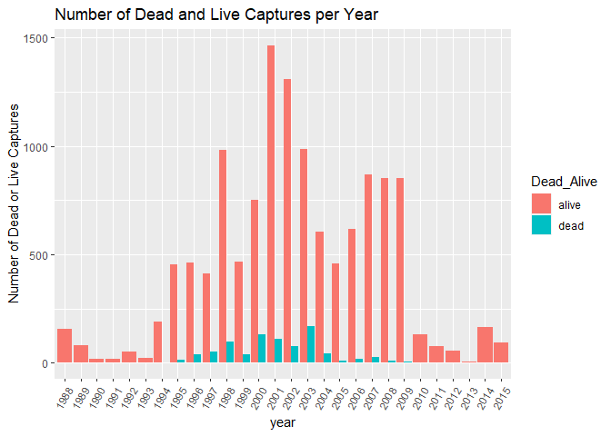

```r
library(here)
```

```
## here() starts at C:/Users/ericc/Desktop/BIS15W2021_ecoyle
```

```r
library(tidyverse)
```

```
## -- Attaching packages --------------------------------------- tidyverse 1.3.0 --
```

```
## v ggplot2 3.3.3     v purrr   0.3.4
## v tibble  3.0.6     v dplyr   1.0.3
## v tidyr   1.1.2     v stringr 1.4.0
## v readr   1.4.0     v forcats 0.5.1
```

```
## -- Conflicts ------------------------------------------ tidyverse_conflicts() --
## x dplyr::filter() masks stats::filter()
## x dplyr::lag()    masks stats::lag()
```

```r
library(naniar)
library(janitor)
```

```
## 
## Attaching package: 'janitor'
```

```
## The following objects are masked from 'package:stats':
## 
##     chisq.test, fisher.test
```

```r
library(shiny)
library(paletteer)
```


```r
turtles<-read.csv(here("Final Project","Turtle_data.csv"))
#turtles
#view(turtles)
```


```r
glimpse(turtles)
```

```
## Rows: 13,435
## Columns: 72
## $ year                     <int> 1995, 1995, 1995, 1995, 1995, 1995, 1995, ...
## $ Turtle_ID                <chr> "1", "1", "2", "2", "3", "3", "4", "4", "5...
## $ ResearchType             <chr> "Misc. Tagging", "Misc. Tagging", "Misc. T...
## $ DateCapture              <chr> "16-May-95", "16-May-95", "24-Apr-95", "24...
## $ Species                  <chr> "Green", "Green", "Loggerhead", "Loggerhea...
## $ Master_tag               <chr> "QQS241", "QQS241", "QQV299", "QQV299", "Q...
## $ Dead_Alive               <chr> "Alive", "Alive", "Alive", "Alive", "Alive...
## $ RecordType               <chr> "Release", "Release", "Release", "Release"...
## $ Inconel_Tag              <chr> "QQS241", "QQS242", "QQV299", "QQV300", "Q...
## $ BodyArea                 <chr> "Left Rear", "Right Rear", "Left Rear", "R...
## $ PIT_tag                  <chr> "None", "None", "NOT TAGGED", "NOT TAGGED"...
## $ BodyArea_PIT             <chr> "", "", "", "", "", "", "", "", "", "", "L...
## $ DateRelease              <chr> "17-May-95", "17-May-95", "26-May-95", "26...
## $ Gear                     <chr> "Gill net", "Gill net", "Gill net", "Gill ...
## $ SCL_notch                <dbl> 29.8, 29.8, 45.9, 45.9, 44.5, 44.5, 58.2, ...
## $ SCL_tip                  <dbl> 30.2, 30.2, 46.4, 46.4, 45.1, 45.1, 59.4, ...
## $ SCW                      <dbl> 25.3, 25.3, 39.8, 39.8, 42.0, 42.0, 49.5, ...
## $ CCL_notch                <dbl> 31.0, 31.0, 49.4, 49.4, 46.1, 46.1, 63.7, ...
## $ CCL_tip                  <dbl> 31.5, 31.5, 50.2, 50.2, 46.5, 46.5, 64.8, ...
## $ CCW                      <dbl> 28.0, 28.0, 47.7, 47.7, 46.0, 46.0, 58.4, ...
## $ Circumference            <dbl> NA, NA, NA, NA, NA, NA, NA, NA, NA, NA, 0,...
## $ Girth                    <dbl> NA, NA, NA, NA, NA, NA, NA, NA, NA, NA, 0,...
## $ Depth_.mid               <dbl> NA, NA, NA, NA, NA, NA, NA, NA, NA, NA, NA...
## $ Tail                     <dbl> NA, NA, NA, NA, NA, NA, NA, NA, NA, NA, NA...
## $ Weight                   <dbl> 3.8, 3.8, 15.3, 15.3, NA, NA, NA, NA, 3.3,...
## $ Cap_Region               <chr> "Inshore", "Inshore", "Inshore", "Inshore"...
## $ Rel_Region               <chr> "Inshore", "Inshore", "Offshore", "Offshor...
## $ Cap_Latitude             <dbl> 34.78, 34.78, 34.77, 34.77, 34.96, 34.96, ...
## $ Cap_Longitude            <dbl> -76.7233, -76.7233, -76.7500, -76.7500, -7...
## $ Rel_Latitude             <dbl> 34.73, 34.73, 34.66, 34.66, 35.00, 35.00, ...
## $ Rel_Longitude            <dbl> -76.69000, -76.69000, -76.66167, -76.66167...
## $ HepTube_Before           <chr> "", "", "", "", "", "", "", "", "", "", ""...
## $ HepTube_After            <chr> "", "", "", "", "", "", "", "", "", "", ""...
## $ TestLevel_Before         <dbl> 0, 0, 0, 0, 0, 0, 0, 0, 0, 0, 0, 0, 0, 0, ...
## $ TestLevel_After          <dbl> 0.0, 0.0, 0.0, 0.0, 0.0, 0.0, 0.0, 0.0, 0....
## $ Lysis_tube_ID            <int> 1, 1, 2, 2, 3, 3, 4, 4, 5, 5, NA, NA, 8, 8...
## $ Skin_Biopsy_ID           <dbl> NA, NA, NA, NA, NA, NA, NA, NA, NA, NA, NA...
## $ Haplotype                <chr> "", "", "", "", "", "", "", "", "", "", ""...
## $ Oxtetracyclene           <lgl> FALSE, FALSE, FALSE, FALSE, FALSE, FALSE, ...
## $ Health_Blood             <lgl> FALSE, FALSE, FALSE, FALSE, FALSE, FALSE, ...
## $ Satellite_tag            <lgl> FALSE, FALSE, FALSE, FALSE, FALSE, FALSE, ...
## $ Holding_Facility         <chr> "", "", "", "", "", "", "", "", "", "", ""...
## $ Sex_laparoscopy          <chr> "Sample was not collected", "Sample was no...
## $ Sex_Necropsy             <chr> "", "", "", "", "Sample was not collected"...
## $ Sex_Testosterone_Level_1 <chr> "", "", "", "", "Sample was not collected"...
## $ Sex_Testosterone_Level_2 <chr> "", "", "", "", "Sample was not collected"...
## $ State                    <chr> "NC", "NC", "NC", "NC", "NC", "NC", "", ""...
## $ Hematology               <lgl> FALSE, FALSE, FALSE, FALSE, FALSE, FALSE, ...
## $ OC_OB                    <lgl> FALSE, FALSE, FALSE, FALSE, FALSE, FALSE, ...
## $ FH                       <lgl> FALSE, FALSE, FALSE, FALSE, FALSE, FALSE, ...
## $ Metals                   <lgl> FALSE, FALSE, FALSE, FALSE, FALSE, FALSE, ...
## $ SIA_skin                 <lgl> FALSE, FALSE, FALSE, FALSE, FALSE, FALSE, ...
## $ SIA_bone                 <lgl> FALSE, FALSE, FALSE, FALSE, FALSE, FALSE, ...
## $ SIA_blood                <lgl> FALSE, FALSE, FALSE, FALSE, FALSE, FALSE, ...
## $ SIA_barnacles            <lgl> FALSE, FALSE, FALSE, FALSE, FALSE, FALSE, ...
## $ SIA_scutes               <lgl> FALSE, FALSE, FALSE, FALSE, FALSE, FALSE, ...
## $ SIA_analyzed             <lgl> FALSE, FALSE, FALSE, FALSE, FALSE, FALSE, ...
## $ Photos                   <lgl> FALSE, FALSE, FALSE, FALSE, FALSE, FALSE, ...
## $ Scute                    <lgl> FALSE, FALSE, FALSE, FALSE, FALSE, FALSE, ...
## $ Cloacal                  <lgl> FALSE, FALSE, FALSE, FALSE, FALSE, FALSE, ...
## $ Lesion                   <lgl> FALSE, FALSE, FALSE, FALSE, FALSE, FALSE, ...
## $ Fat                      <lgl> FALSE, FALSE, FALSE, FALSE, FALSE, FALSE, ...
## $ Fecal                    <lgl> FALSE, FALSE, FALSE, FALSE, FALSE, FALSE, ...
## $ Pathogens                <lgl> FALSE, FALSE, FALSE, FALSE, FALSE, FALSE, ...
## $ PCV                      <dbl> NA, NA, NA, NA, NA, NA, NA, NA, NA, NA, NA...
## $ TS                       <dbl> NA, NA, NA, NA, NA, NA, NA, NA, NA, NA, NA...
## $ Entangled                <lgl> FALSE, FALSE, FALSE, FALSE, FALSE, FALSE, ...
## $ Imaging                  <lgl> FALSE, FALSE, FALSE, FALSE, FALSE, FALSE, ...
## $ OrganBiopsy              <lgl> FALSE, FALSE, FALSE, FALSE, FALSE, FALSE, ...
## $ LivingTag                <lgl> FALSE, FALSE, FALSE, FALSE, FALSE, FALSE, ...
## $ RadioTag                 <lgl> FALSE, FALSE, FALSE, FALSE, FALSE, FALSE, ...
## $ AcousticTag              <lgl> FALSE, FALSE, FALSE, FALSE, FALSE, FALSE, ...
```


```r
turtles%>%
  naniar::miss_var_summary()
```

```
## # A tibble: 72 x 3
##    variable        n_miss pct_miss
##    <chr>            <int>    <dbl>
##  1 Tail             13427     99.9
##  2 Lysis_tube_ID    11757     87.5
##  3 Depth_.mid       11206     83.4
##  4 PCV               9702     72.2
##  5 TS                9702     72.2
##  6 Skin_Biopsy_ID    8858     65.9
##  7 Weight            7080     52.7
##  8 TestLevel_After   6652     49.5
##  9 Circumference     5793     43.1
## 10 Girth             5622     41.8
## # ... with 62 more rows
```

```r
turtles%>%
  tabyl(Species)
```

```
##       Species     n      percent
##                   1 7.443245e-05
##         Green  1850 1.377000e-01
##     Hawksbill     2 1.488649e-04
##  Kemps_Ridley   790 5.880164e-02
##   Leatherback     4 2.977298e-04
##    Loggerhead 10786 8.028284e-01
##            UN     2 1.488649e-04
```

```r
turtles%>%
  group_by(Species)%>%
  summarise(across(contains("CL"),mean,na.rm=T))
```

```
## # A tibble: 7 x 8
##   Species SCL_notch SCL_tip CCL_notch CCL_tip Oxtetracyclene SIA_barnacles
## * <chr>       <dbl>   <dbl>     <dbl>   <dbl>          <dbl>         <dbl>
## 1 ""           28.6    29.2      30.3    31           0            0      
## 2 "Green"      22.2    22.7      23.2    24.1         0.0108       0      
## 3 "Hawks~     NaN     NaN       NaN      33           0            0      
## 4 "Kemps~      30.2    29.0      31.6    31.8         0.0278       0.00253
## 5 "Leath~     137.    NaN       NaN     NaN           0            0      
## 6 "Logge~      56.2    56.0      59.8    60.1         0.0289       0.0282 
## 7 "UN"        NaN       0       NaN       0           0            0      
## # ... with 1 more variable: Cloacal <dbl>
```


```r
turtles%>%
  group_by(year)%>%
  count(Dead_Alive)
```

```
## # A tibble: 46 x 3
## # Groups:   year [28]
##     year Dead_Alive     n
##    <int> <chr>      <int>
##  1  1988 Alive        154
##  2  1989 Alive         82
##  3  1990 Alive         18
##  4  1991 Alive         17
##  5  1992 Alive         50
##  6  1993 Alive         22
##  7  1994 Alive        191
##  8  1994 Dead           2
##  9  1995 Alive        452
## 10  1995 Dead          12
## # ... with 36 more rows
```

```r
turtles%>%
  group_by(year)%>%
  ggplot(aes(x=year,fill=Dead_Alive))+
  geom_bar(position = "dodge")
```

<!-- -->

```r
turtles%>%
  filter(Dead_Alive=="")
```

```
##   year Turtle_ID                  ResearchType DateCapture Species Master_tag
## 1 2007      dead Index of Abundance  pound net   22-Nov-07                   
##   Dead_Alive RecordType Inconel_Tag  BodyArea PIT_tag BodyArea_PIT DateRelease
## 1               Release        none Left Rear    None   Left Front            
##        Gear SCL_notch SCL_tip  SCW CCL_notch CCL_tip CCW Circumference Girth
## 1 Pound net      28.6    29.2 23.3      30.3      31  26             0    10
##   Depth_.mid Tail Weight Cap_Region Rel_Region Cap_Latitude Cap_Longitude
## 1         NA   NA      0    Inshore                   35.21      -75.8086
##   Rel_Latitude Rel_Longitude HepTube_Before HepTube_After TestLevel_Before
## 1           NA             0                                             0
##   TestLevel_After Lysis_tube_ID Skin_Biopsy_ID Haplotype Oxtetracyclene
## 1               0            NA           3608                    FALSE
##   Health_Blood Satellite_tag Holding_Facility Sex_laparoscopy Sex_Necropsy
## 1        FALSE         FALSE                                              
##   Sex_Testosterone_Level_1 Sex_Testosterone_Level_2 State Hematology OC_OB
## 1                                                      NC      FALSE FALSE
##      FH Metals SIA_skin SIA_bone SIA_blood SIA_barnacles SIA_scutes
## 1 FALSE  FALSE    FALSE    FALSE     FALSE         FALSE      FALSE
##   SIA_analyzed Photos Scute Cloacal Lesion   Fat Fecal Pathogens PCV TS
## 1        FALSE  FALSE FALSE   FALSE  FALSE FALSE FALSE     FALSE   0  0
##   Entangled Imaging OrganBiopsy LivingTag RadioTag AcousticTag
## 1     FALSE   FALSE       FALSE     FALSE    FALSE       FALSE
```


```r
turtles_tidy<-turtles%>%
  mutate_all(tolower)
```


```r
turtles_tidy%>%
  group_by(year)%>%
  filter(Dead_Alive!="")%>%
  ggplot(aes(x=year,fill=Dead_Alive))+
  geom_bar(position = "dodge")+
  labs(title = "Number of Dead and Live Captures per Year",x="year",y="Number of Dead or Live Captures")+
  theme(axis.text.x = element_text(angle = 60,hjust = 1))
```

<!-- -->

```r
turtles%>%
  group_by(Species)%>%
  summarise(mean_SCL_tip=mean(SCL_tip,na.rm=T))
```

```
## # A tibble: 7 x 2
##   Species        mean_SCL_tip
## * <chr>                 <dbl>
## 1 ""                     29.2
## 2 "Green"                22.7
## 3 "Hawksbill"           NaN  
## 4 "Kemps_Ridley"         29.0
## 5 "Leatherback"         NaN  
## 6 "Loggerhead"           56.0
## 7 "UN"                    0
```


```r
turtles%>%
  filter(Gear!="")%>%
  tabyl(Gear,Species)
```

```
##                     Gear Green Hawksbill Kemps_Ridley Leatherback Loggerhead UN
##              Channel net     0         0            2           0          2  0
##           Dead Stranding     5         0            7           0        223  0
##             Entanglement     0         0            3           0         12  0
##           Flounder trawl     0         0            0           0          2  0
##  General public sighting     1         0            0           0          6  0
##                 Gill net    30         2           52           4        317  0
##            Hand captured     0         0            2           0         10  0
##                Headstart     0         0            0           0          4  0
##            Hook and line     0         0            9           0          8  0
##         Leased Pound Net    81         0           67           0        124  0
##           Live stranding    19         0            8           0         61  0
##                Long haul    22         0           52           0        192  0
##                Pound net  1692         0          588           0       9795  2
##             Shrimp trawl     0         0            0           0          8  0
##            Skimmer Trawl     0         0            0           0         22  0
##  emptystring_
##             0
##             0
##             0
##             0
##             0
##             0
##             0
##             0
##             0
##             0
##             0
##             0
##             1
##             0
##             0
```

```r
turtles%>%
  filter(Gear!=""&Species!="")%>%
  ggplot(aes(x=Gear,fill=Species))+
  geom_bar(position = "dodge")+
  labs(title = "Gear used for Different Spcies",x="Gear",y="Number Captured with Given Method")+
  theme(axis.text.x = element_text(angle = 60,hjust = 1))
```

<!-- -->

```r
turtles_tidy2<-turtles%>%
  na_if("")%>%
  na_if("0")%>%
  na_if("0.0")
```

```r
turtles_tidy2%>%
  tabyl(Sex_laparoscopy)
```

```
##           Sex_laparoscopy     n      percent valid_percent
##                    Female   434 0.0323036844  0.0350028228
##                      Male   152 0.0113137328  0.0122590531
##      Sample was collected    12 0.0008931894  0.0009678200
##  Sample was not collected 11797 0.8780796427  0.9514476974
##               Unknown sex     4 0.0002977298  0.0003226067
##                      <NA>  1036 0.0771120208            NA
```

```r
turtles3<-turtles_tidy2%>%
  mutate(dead_alive_new=if_else(Dead_Alive=="alive","Alive",Dead_Alive))
turtles3%>%
  tabyl(dead_alive_new)
```

```
##  dead_alive_new     n      percent valid_percent
##           Alive 12598 9.377000e-01    0.93776984
##            Dead   836 6.222553e-02    0.06223016
##            <NA>     1 7.443245e-05            NA
```

