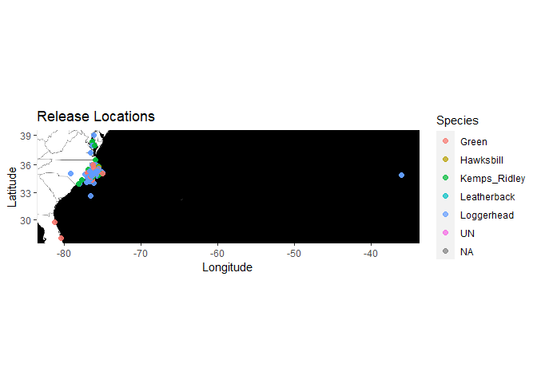

```r
library(here)
```

```
## here() starts at C:/Users/ericc/Desktop/BIS15W2021_ecoyle
```

```r
library(tidyverse)
```

```
## -- Attaching packages --------------------------------------- tidyverse 1.3.0 --
```

```
## v ggplot2 3.3.3     v purrr   0.3.4
## v tibble  3.0.6     v dplyr   1.0.3
## v tidyr   1.1.2     v stringr 1.4.0
## v readr   1.4.0     v forcats 0.5.1
```

```
## -- Conflicts ------------------------------------------ tidyverse_conflicts() --
## x dplyr::filter() masks stats::filter()
## x dplyr::lag()    masks stats::lag()
```

```r
library(naniar)
library(janitor)
```

```
## 
## Attaching package: 'janitor'
```

```
## The following objects are masked from 'package:stats':
## 
##     chisq.test, fisher.test
```

```r
library(shiny)
library(paletteer)
```


```r
turtles<-read.csv(here("Final Project","Turtle_data.csv"))
#turtles
#view(turtles)
```


```r
glimpse(turtles)
```

```
## Rows: 13,435
## Columns: 72
## $ year                     <int> 1995, 1995, 1995, 1995, 1995, 1995, 1995, ...
## $ Turtle_ID                <chr> "1", "1", "2", "2", "3", "3", "4", "4", "5...
## $ ResearchType             <chr> "Misc. Tagging", "Misc. Tagging", "Misc. T...
## $ DateCapture              <chr> "16-May-95", "16-May-95", "24-Apr-95", "24...
## $ Species                  <chr> "Green", "Green", "Loggerhead", "Loggerhea...
## $ Master_tag               <chr> "QQS241", "QQS241", "QQV299", "QQV299", "Q...
## $ Dead_Alive               <chr> "Alive", "Alive", "Alive", "Alive", "Alive...
## $ RecordType               <chr> "Release", "Release", "Release", "Release"...
## $ Inconel_Tag              <chr> "QQS241", "QQS242", "QQV299", "QQV300", "Q...
## $ BodyArea                 <chr> "Left Rear", "Right Rear", "Left Rear", "R...
## $ PIT_tag                  <chr> "None", "None", "NOT TAGGED", "NOT TAGGED"...
## $ BodyArea_PIT             <chr> "", "", "", "", "", "", "", "", "", "", "L...
## $ DateRelease              <chr> "17-May-95", "17-May-95", "26-May-95", "26...
## $ Gear                     <chr> "Gill net", "Gill net", "Gill net", "Gill ...
## $ SCL_notch                <dbl> 29.8, 29.8, 45.9, 45.9, 44.5, 44.5, 58.2, ...
## $ SCL_tip                  <dbl> 30.2, 30.2, 46.4, 46.4, 45.1, 45.1, 59.4, ...
## $ SCW                      <dbl> 25.3, 25.3, 39.8, 39.8, 42.0, 42.0, 49.5, ...
## $ CCL_notch                <dbl> 31.0, 31.0, 49.4, 49.4, 46.1, 46.1, 63.7, ...
## $ CCL_tip                  <dbl> 31.5, 31.5, 50.2, 50.2, 46.5, 46.5, 64.8, ...
## $ CCW                      <dbl> 28.0, 28.0, 47.7, 47.7, 46.0, 46.0, 58.4, ...
## $ Circumference            <dbl> NA, NA, NA, NA, NA, NA, NA, NA, NA, NA, 0,...
## $ Girth                    <dbl> NA, NA, NA, NA, NA, NA, NA, NA, NA, NA, 0,...
## $ Depth_.mid               <dbl> NA, NA, NA, NA, NA, NA, NA, NA, NA, NA, NA...
## $ Tail                     <dbl> NA, NA, NA, NA, NA, NA, NA, NA, NA, NA, NA...
## $ Weight                   <dbl> 3.8, 3.8, 15.3, 15.3, NA, NA, NA, NA, 3.3,...
## $ Cap_Region               <chr> "Inshore", "Inshore", "Inshore", "Inshore"...
## $ Rel_Region               <chr> "Inshore", "Inshore", "Offshore", "Offshor...
## $ Cap_Latitude             <dbl> 34.78, 34.78, 34.77, 34.77, 34.96, 34.96, ...
## $ Cap_Longitude            <dbl> -76.7233, -76.7233, -76.7500, -76.7500, -7...
## $ Rel_Latitude             <dbl> 34.73, 34.73, 34.66, 34.66, 35.00, 35.00, ...
## $ Rel_Longitude            <dbl> -76.69000, -76.69000, -76.66167, -76.66167...
## $ HepTube_Before           <chr> "", "", "", "", "", "", "", "", "", "", ""...
## $ HepTube_After            <chr> "", "", "", "", "", "", "", "", "", "", ""...
## $ TestLevel_Before         <dbl> 0, 0, 0, 0, 0, 0, 0, 0, 0, 0, 0, 0, 0, 0, ...
## $ TestLevel_After          <dbl> 0.0, 0.0, 0.0, 0.0, 0.0, 0.0, 0.0, 0.0, 0....
## $ Lysis_tube_ID            <int> 1, 1, 2, 2, 3, 3, 4, 4, 5, 5, NA, NA, 8, 8...
## $ Skin_Biopsy_ID           <dbl> NA, NA, NA, NA, NA, NA, NA, NA, NA, NA, NA...
## $ Haplotype                <chr> "", "", "", "", "", "", "", "", "", "", ""...
## $ Oxtetracyclene           <lgl> FALSE, FALSE, FALSE, FALSE, FALSE, FALSE, ...
## $ Health_Blood             <lgl> FALSE, FALSE, FALSE, FALSE, FALSE, FALSE, ...
## $ Satellite_tag            <lgl> FALSE, FALSE, FALSE, FALSE, FALSE, FALSE, ...
## $ Holding_Facility         <chr> "", "", "", "", "", "", "", "", "", "", ""...
## $ Sex_laparoscopy          <chr> "Sample was not collected", "Sample was no...
## $ Sex_Necropsy             <chr> "", "", "", "", "Sample was not collected"...
## $ Sex_Testosterone_Level_1 <chr> "", "", "", "", "Sample was not collected"...
## $ Sex_Testosterone_Level_2 <chr> "", "", "", "", "Sample was not collected"...
## $ State                    <chr> "NC", "NC", "NC", "NC", "NC", "NC", "", ""...
## $ Hematology               <lgl> FALSE, FALSE, FALSE, FALSE, FALSE, FALSE, ...
## $ OC_OB                    <lgl> FALSE, FALSE, FALSE, FALSE, FALSE, FALSE, ...
## $ FH                       <lgl> FALSE, FALSE, FALSE, FALSE, FALSE, FALSE, ...
## $ Metals                   <lgl> FALSE, FALSE, FALSE, FALSE, FALSE, FALSE, ...
## $ SIA_skin                 <lgl> FALSE, FALSE, FALSE, FALSE, FALSE, FALSE, ...
## $ SIA_bone                 <lgl> FALSE, FALSE, FALSE, FALSE, FALSE, FALSE, ...
## $ SIA_blood                <lgl> FALSE, FALSE, FALSE, FALSE, FALSE, FALSE, ...
## $ SIA_barnacles            <lgl> FALSE, FALSE, FALSE, FALSE, FALSE, FALSE, ...
## $ SIA_scutes               <lgl> FALSE, FALSE, FALSE, FALSE, FALSE, FALSE, ...
## $ SIA_analyzed             <lgl> FALSE, FALSE, FALSE, FALSE, FALSE, FALSE, ...
## $ Photos                   <lgl> FALSE, FALSE, FALSE, FALSE, FALSE, FALSE, ...
## $ Scute                    <lgl> FALSE, FALSE, FALSE, FALSE, FALSE, FALSE, ...
## $ Cloacal                  <lgl> FALSE, FALSE, FALSE, FALSE, FALSE, FALSE, ...
## $ Lesion                   <lgl> FALSE, FALSE, FALSE, FALSE, FALSE, FALSE, ...
## $ Fat                      <lgl> FALSE, FALSE, FALSE, FALSE, FALSE, FALSE, ...
## $ Fecal                    <lgl> FALSE, FALSE, FALSE, FALSE, FALSE, FALSE, ...
## $ Pathogens                <lgl> FALSE, FALSE, FALSE, FALSE, FALSE, FALSE, ...
## $ PCV                      <dbl> NA, NA, NA, NA, NA, NA, NA, NA, NA, NA, NA...
## $ TS                       <dbl> NA, NA, NA, NA, NA, NA, NA, NA, NA, NA, NA...
## $ Entangled                <lgl> FALSE, FALSE, FALSE, FALSE, FALSE, FALSE, ...
## $ Imaging                  <lgl> FALSE, FALSE, FALSE, FALSE, FALSE, FALSE, ...
## $ OrganBiopsy              <lgl> FALSE, FALSE, FALSE, FALSE, FALSE, FALSE, ...
## $ LivingTag                <lgl> FALSE, FALSE, FALSE, FALSE, FALSE, FALSE, ...
## $ RadioTag                 <lgl> FALSE, FALSE, FALSE, FALSE, FALSE, FALSE, ...
## $ AcousticTag              <lgl> FALSE, FALSE, FALSE, FALSE, FALSE, FALSE, ...
```


```r
turtles%>%
  naniar::miss_var_summary()
```

```
## # A tibble: 72 x 3
##    variable        n_miss pct_miss
##    <chr>            <int>    <dbl>
##  1 Tail             13427     99.9
##  2 Lysis_tube_ID    11757     87.5
##  3 Depth_.mid       11206     83.4
##  4 PCV               9702     72.2
##  5 TS                9702     72.2
##  6 Skin_Biopsy_ID    8858     65.9
##  7 Weight            7080     52.7
##  8 TestLevel_After   6652     49.5
##  9 Circumference     5793     43.1
## 10 Girth             5622     41.8
## # ... with 62 more rows
```

```r
turtles%>%
  tabyl(Species)
```

```
##       Species     n      percent
##                   1 7.443245e-05
##         Green  1850 1.377000e-01
##     Hawksbill     2 1.488649e-04
##  Kemps_Ridley   790 5.880164e-02
##   Leatherback     4 2.977298e-04
##    Loggerhead 10786 8.028284e-01
##            UN     2 1.488649e-04
```

```r
turtles%>%
  group_by(Species)%>%
  summarise(across(contains("CL"),mean,na.rm=T))
```

```
## # A tibble: 7 x 8
##   Species SCL_notch SCL_tip CCL_notch CCL_tip Oxtetracyclene SIA_barnacles
## * <chr>       <dbl>   <dbl>     <dbl>   <dbl>          <dbl>         <dbl>
## 1 ""           28.6    29.2      30.3    31           0            0      
## 2 "Green"      22.2    22.7      23.2    24.1         0.0108       0      
## 3 "Hawks~     NaN     NaN       NaN      33           0            0      
## 4 "Kemps~      30.2    29.0      31.6    31.8         0.0278       0.00253
## 5 "Leath~     137.    NaN       NaN     NaN           0            0      
## 6 "Logge~      56.2    56.0      59.8    60.1         0.0289       0.0282 
## 7 "UN"        NaN       0       NaN       0           0            0      
## # ... with 1 more variable: Cloacal <dbl>
```


```r
turtles%>%
  group_by(year)%>%
  count(Dead_Alive)
```

```
## # A tibble: 46 x 3
## # Groups:   year [28]
##     year Dead_Alive     n
##    <int> <chr>      <int>
##  1  1988 Alive        154
##  2  1989 Alive         82
##  3  1990 Alive         18
##  4  1991 Alive         17
##  5  1992 Alive         50
##  6  1993 Alive         22
##  7  1994 Alive        191
##  8  1994 Dead           2
##  9  1995 Alive        452
## 10  1995 Dead          12
## # ... with 36 more rows
```

```r
turtles%>%
  group_by(year)%>%
  ggplot(aes(x=year,fill=Dead_Alive))+
  geom_bar(position = "dodge")
```

<!-- -->

```r
turtles%>%
  filter(Dead_Alive=="")
```

```
##   year Turtle_ID                  ResearchType DateCapture Species Master_tag
## 1 2007      dead Index of Abundance  pound net   22-Nov-07                   
##   Dead_Alive RecordType Inconel_Tag  BodyArea PIT_tag BodyArea_PIT DateRelease
## 1               Release        none Left Rear    None   Left Front            
##        Gear SCL_notch SCL_tip  SCW CCL_notch CCL_tip CCW Circumference Girth
## 1 Pound net      28.6    29.2 23.3      30.3      31  26             0    10
##   Depth_.mid Tail Weight Cap_Region Rel_Region Cap_Latitude Cap_Longitude
## 1         NA   NA      0    Inshore                   35.21      -75.8086
##   Rel_Latitude Rel_Longitude HepTube_Before HepTube_After TestLevel_Before
## 1           NA             0                                             0
##   TestLevel_After Lysis_tube_ID Skin_Biopsy_ID Haplotype Oxtetracyclene
## 1               0            NA           3608                    FALSE
##   Health_Blood Satellite_tag Holding_Facility Sex_laparoscopy Sex_Necropsy
## 1        FALSE         FALSE                                              
##   Sex_Testosterone_Level_1 Sex_Testosterone_Level_2 State Hematology OC_OB
## 1                                                      NC      FALSE FALSE
##      FH Metals SIA_skin SIA_bone SIA_blood SIA_barnacles SIA_scutes
## 1 FALSE  FALSE    FALSE    FALSE     FALSE         FALSE      FALSE
##   SIA_analyzed Photos Scute Cloacal Lesion   Fat Fecal Pathogens PCV TS
## 1        FALSE  FALSE FALSE   FALSE  FALSE FALSE FALSE     FALSE   0  0
##   Entangled Imaging OrganBiopsy LivingTag RadioTag AcousticTag
## 1     FALSE   FALSE       FALSE     FALSE    FALSE       FALSE
```


```r
turtles%>%
  group_by(year)%>%
  filter(Dead_Alive!="")%>%
  ggplot(aes(x=year,fill=Dead_Alive))+
  geom_bar(position = "dodge")+
  labs(title = "Number of Dead and Live Captures per Year",x="year",y="Number of Dead or Live Captures")+
  theme(axis.text.x = element_text(angle = 60,hjust = 1))
```

<!-- -->

```r
turtles%>%
  group_by(Species)%>%
  summarise(mean_SCL_tip=mean(SCL_tip,na.rm=T))
```

```
## # A tibble: 7 x 2
##   Species        mean_SCL_tip
## * <chr>                 <dbl>
## 1 ""                     29.2
## 2 "Green"                22.7
## 3 "Hawksbill"           NaN  
## 4 "Kemps_Ridley"         29.0
## 5 "Leatherback"         NaN  
## 6 "Loggerhead"           56.0
## 7 "UN"                    0
```


```r
turtles%>%
  filter(Gear!="")%>%
  tabyl(Gear,Species)
```

```
##                     Gear Green Hawksbill Kemps_Ridley Leatherback Loggerhead UN
##              Channel net     0         0            2           0          2  0
##           Dead Stranding     5         0            7           0        223  0
##             Entanglement     0         0            3           0         12  0
##           Flounder trawl     0         0            0           0          2  0
##  General public sighting     1         0            0           0          6  0
##                 Gill net    30         2           52           4        317  0
##            Hand captured     0         0            2           0         10  0
##                Headstart     0         0            0           0          4  0
##            Hook and line     0         0            9           0          8  0
##         Leased Pound Net    81         0           67           0        124  0
##           Live stranding    19         0            8           0         61  0
##                Long haul    22         0           52           0        192  0
##                Pound net  1692         0          588           0       9795  2
##             Shrimp trawl     0         0            0           0          8  0
##            Skimmer Trawl     0         0            0           0         22  0
##  emptystring_
##             0
##             0
##             0
##             0
##             0
##             0
##             0
##             0
##             0
##             0
##             0
##             0
##             1
##             0
##             0
```

```r
turtles%>%
  filter(Gear!=""&Species!="")%>%
  ggplot(aes(x=Gear,fill=Species))+
  geom_bar(position = "dodge")+
  labs(title = "Gear used for Different Spcies",x="Gear",y="Number Captured with Given Method")+
  theme(axis.text.x = element_text(angle = 60,hjust = 1))
```

<!-- -->

```r
turtles_tidy2<-turtles%>%
  na_if("")%>%
  na_if("0")%>%
  na_if("0.0")
```


```r
turtles_tidy2%>%
  tabyl(Sex_laparoscopy)
```

```
##           Sex_laparoscopy     n      percent valid_percent
##                    Female   434 0.0323036844  0.0350028228
##                      Male   152 0.0113137328  0.0122590531
##      Sample was collected    12 0.0008931894  0.0009678200
##  Sample was not collected 11797 0.8780796427  0.9514476974
##               Unknown sex     4 0.0002977298  0.0003226067
##                      <NA>  1036 0.0771120208            NA
```

```r
turtles3<-turtles_tidy2%>%
  mutate(dead_alive_new=if_else(Dead_Alive=="alive","Alive",Dead_Alive))
turtles3%>%
  tabyl(dead_alive_new)
```

```
##  dead_alive_new     n      percent valid_percent
##           Alive 12598 9.377000e-01    0.93776984
##            Dead   836 6.222553e-02    0.06223016
##            <NA>     1 7.443245e-05            NA
```

```r
library(ggmap)
```

```
## Google's Terms of Service: https://cloud.google.com/maps-platform/terms/.
```

```
## Please cite ggmap if you use it! See citation("ggmap") for details.
```

```r
library(tidyverse)
library(rgeos)
```

```
## Loading required package: sp
```

```
## rgeos version: 0.5-5, (SVN revision 640)
##  GEOS runtime version: 3.8.0-CAPI-1.13.1 
##  Linking to sp version: 1.4-5 
##  Polygon checking: TRUE
```

```r
library(rgdal)
```

```
## rgdal: version: 1.5-23, (SVN revision 1121)
## Geospatial Data Abstraction Library extensions to R successfully loaded
## Loaded GDAL runtime: GDAL 3.2.1, released 2020/12/29
## Path to GDAL shared files: C:/Users/ericc/Documents/R/win-library/4.0/rgdal/gdal
## GDAL binary built with GEOS: TRUE 
## Loaded PROJ runtime: Rel. 7.2.1, January 1st, 2021, [PJ_VERSION: 721]
## Path to PROJ shared files: C:/Users/ericc/Documents/R/win-library/4.0/rgdal/proj
## PROJ CDN enabled: FALSE
## Linking to sp version:1.4-5
## To mute warnings of possible GDAL/OSR exportToProj4() degradation,
## use options("rgdal_show_exportToProj4_warnings"="none") before loading rgdal.
## Overwritten PROJ_LIB was C:/Users/ericc/Documents/R/win-library/4.0/rgdal/proj
```

```r
library(devtools)
```

```
## Loading required package: usethis
```


```r
names(turtles3)
```

```
##  [1] "year"                     "Turtle_ID"               
##  [3] "ResearchType"             "DateCapture"             
##  [5] "Species"                  "Master_tag"              
##  [7] "Dead_Alive"               "RecordType"              
##  [9] "Inconel_Tag"              "BodyArea"                
## [11] "PIT_tag"                  "BodyArea_PIT"            
## [13] "DateRelease"              "Gear"                    
## [15] "SCL_notch"                "SCL_tip"                 
## [17] "SCW"                      "CCL_notch"               
## [19] "CCL_tip"                  "CCW"                     
## [21] "Circumference"            "Girth"                   
## [23] "Depth_.mid"               "Tail"                    
## [25] "Weight"                   "Cap_Region"              
## [27] "Rel_Region"               "Cap_Latitude"            
## [29] "Cap_Longitude"            "Rel_Latitude"            
## [31] "Rel_Longitude"            "HepTube_Before"          
## [33] "HepTube_After"            "TestLevel_Before"        
## [35] "TestLevel_After"          "Lysis_tube_ID"           
## [37] "Skin_Biopsy_ID"           "Haplotype"               
## [39] "Oxtetracyclene"           "Health_Blood"            
## [41] "Satellite_tag"            "Holding_Facility"        
## [43] "Sex_laparoscopy"          "Sex_Necropsy"            
## [45] "Sex_Testosterone_Level_1" "Sex_Testosterone_Level_2"
## [47] "State"                    "Hematology"              
## [49] "OC_OB"                    "FH"                      
## [51] "Metals"                   "SIA_skin"                
## [53] "SIA_bone"                 "SIA_blood"               
## [55] "SIA_barnacles"            "SIA_scutes"              
## [57] "SIA_analyzed"             "Photos"                  
## [59] "Scute"                    "Cloacal"                 
## [61] "Lesion"                   "Fat"                     
## [63] "Fecal"                    "Pathogens"               
## [65] "PCV"                      "TS"                      
## [67] "Entangled"                "Imaging"                 
## [69] "OrganBiopsy"              "LivingTag"               
## [71] "RadioTag"                 "AcousticTag"             
## [73] "dead_alive_new"
```

```r
head(turtles3)
```

```
##   year Turtle_ID  ResearchType DateCapture      Species Master_tag Dead_Alive
## 1 1995         1 Misc. Tagging   16-May-95        Green     QQS241      Alive
## 2 1995         1 Misc. Tagging   16-May-95        Green     QQS241      Alive
## 3 1995         2 Misc. Tagging   24-Apr-95   Loggerhead     QQV299      Alive
## 4 1995         2 Misc. Tagging   24-Apr-95   Loggerhead     QQV299      Alive
## 5 1995         3 Misc. Tagging   12-Jun-95 Kemps_Ridley     QQV296      Alive
## 6 1995         3 Misc. Tagging   12-Jun-95 Kemps_Ridley     QQV296      Alive
##   RecordType Inconel_Tag   BodyArea    PIT_tag BodyArea_PIT DateRelease
## 1    Release      QQS241  Left Rear       None         <NA>   17-May-95
## 2    Release      QQS242 Right Rear       None         <NA>   17-May-95
## 3    Release      QQV299  Left Rear NOT TAGGED         <NA>   26-May-95
## 4    Release      QQV300 Right Rear NOT TAGGED         <NA>   26-May-95
## 5    Release      QQV296  Left Rear       None         <NA>   12-Jun-95
## 6    Release      QQV297 Right Rear       None         <NA>   12-Jun-95
##        Gear SCL_notch SCL_tip  SCW CCL_notch CCL_tip  CCW Circumference Girth
## 1  Gill net      29.8    30.2 25.3      31.0    31.5 28.0            NA    NA
## 2  Gill net      29.8    30.2 25.3      31.0    31.5 28.0            NA    NA
## 3  Gill net      45.9    46.4 39.8      49.4    50.2 47.7            NA    NA
## 4  Gill net      45.9    46.4 39.8      49.4    50.2 47.7            NA    NA
## 5 Pound net      44.5    45.1 42.0      46.1    46.5 46.0            NA    NA
## 6 Pound net      44.5    45.1 42.0      46.1    46.5 46.0            NA    NA
##   Depth_.mid Tail Weight Cap_Region Rel_Region Cap_Latitude Cap_Longitude
## 1         NA   NA    3.8    Inshore    Inshore        34.78      -76.7233
## 2         NA   NA    3.8    Inshore    Inshore        34.78      -76.7233
## 3         NA   NA   15.3    Inshore   Offshore        34.77      -76.7500
## 4         NA   NA   15.3    Inshore   Offshore        34.77      -76.7500
## 5         NA   NA     NA    Inshore    Inshore        34.96      -76.2633
## 6         NA   NA     NA    Inshore    Inshore        34.96      -76.2633
##   Rel_Latitude Rel_Longitude HepTube_Before HepTube_After TestLevel_Before
## 1        34.73     -76.69000           <NA>          <NA>               NA
## 2        34.73     -76.69000           <NA>          <NA>               NA
## 3        34.66     -76.66167           <NA>          <NA>               NA
## 4        34.66     -76.66167           <NA>          <NA>               NA
## 5        35.00     -76.30500           <NA>          <NA>               NA
## 6        35.00     -76.30500           <NA>          <NA>               NA
##   TestLevel_After Lysis_tube_ID Skin_Biopsy_ID Haplotype Oxtetracyclene
## 1              NA             1             NA      <NA>          FALSE
## 2              NA             1             NA      <NA>          FALSE
## 3              NA             2             NA      <NA>          FALSE
## 4              NA             2             NA      <NA>          FALSE
## 5              NA             3             NA      <NA>          FALSE
## 6              NA             3             NA      <NA>          FALSE
##   Health_Blood Satellite_tag Holding_Facility          Sex_laparoscopy
## 1        FALSE         FALSE             <NA> Sample was not collected
## 2        FALSE         FALSE             <NA> Sample was not collected
## 3        FALSE         FALSE             <NA> Sample was not collected
## 4        FALSE         FALSE             <NA> Sample was not collected
## 5        FALSE         FALSE             <NA> Sample was not collected
## 6        FALSE         FALSE             <NA> Sample was not collected
##               Sex_Necropsy Sex_Testosterone_Level_1 Sex_Testosterone_Level_2
## 1                     <NA>                     <NA>                     <NA>
## 2                     <NA>                     <NA>                     <NA>
## 3                     <NA>                     <NA>                     <NA>
## 4                     <NA>                     <NA>                     <NA>
## 5 Sample was not collected Sample was not collected Sample was not collected
## 6 Sample was not collected Sample was not collected Sample was not collected
##   State Hematology OC_OB    FH Metals SIA_skin SIA_bone SIA_blood SIA_barnacles
## 1    NC      FALSE FALSE FALSE  FALSE    FALSE    FALSE     FALSE         FALSE
## 2    NC      FALSE FALSE FALSE  FALSE    FALSE    FALSE     FALSE         FALSE
## 3    NC      FALSE FALSE FALSE  FALSE    FALSE    FALSE     FALSE         FALSE
## 4    NC      FALSE FALSE FALSE  FALSE    FALSE    FALSE     FALSE         FALSE
## 5    NC      FALSE FALSE FALSE  FALSE    FALSE    FALSE     FALSE         FALSE
## 6    NC      FALSE FALSE FALSE  FALSE    FALSE    FALSE     FALSE         FALSE
##   SIA_scutes SIA_analyzed Photos Scute Cloacal Lesion   Fat Fecal Pathogens PCV
## 1      FALSE        FALSE  FALSE FALSE   FALSE  FALSE FALSE FALSE     FALSE  NA
## 2      FALSE        FALSE  FALSE FALSE   FALSE  FALSE FALSE FALSE     FALSE  NA
## 3      FALSE        FALSE  FALSE FALSE   FALSE  FALSE FALSE FALSE     FALSE  NA
## 4      FALSE        FALSE  FALSE FALSE   FALSE  FALSE FALSE FALSE     FALSE  NA
## 5      FALSE        FALSE  FALSE FALSE   FALSE  FALSE FALSE FALSE     FALSE  NA
## 6      FALSE        FALSE  FALSE FALSE   FALSE  FALSE FALSE FALSE     FALSE  NA
##   TS Entangled Imaging OrganBiopsy LivingTag RadioTag AcousticTag
## 1 NA     FALSE   FALSE       FALSE     FALSE    FALSE       FALSE
## 2 NA     FALSE   FALSE       FALSE     FALSE    FALSE       FALSE
## 3 NA     FALSE   FALSE       FALSE     FALSE    FALSE       FALSE
## 4 NA     FALSE   FALSE       FALSE     FALSE    FALSE       FALSE
## 5 NA     FALSE   FALSE       FALSE     FALSE    FALSE       FALSE
## 6 NA     FALSE   FALSE       FALSE     FALSE    FALSE       FALSE
##   dead_alive_new
## 1          Alive
## 2          Alive
## 3          Alive
## 4          Alive
## 5          Alive
## 6          Alive
```

```r
turtles3%>%
  tabyl(ResearchType)
```

```
##                   ResearchType    n   percent
##  Index of Abundance  pound net 4716 0.3510234
##                  Misc. Tagging 8719 0.6489766
```


```r
turtles3%>%
  tabyl(BodyArea)
```

```
##     BodyArea    n     percent valid_percent
##   Left Front  162 0.012058057    0.01207964
##    Left Rear 6618 0.492593971    0.49347551
##  Right Front  151 0.011239300    0.01125941
##   Right Rear 6480 0.482322293    0.48318544
##         <NA>   24 0.001786379            NA
```


```r
turtles3%>%
  select(Cap_Latitude,Cap_Longitude)%>%
  summary()
```

```
##   Cap_Latitude   Cap_Longitude   
##  Min.   :33.49   Min.   :-79.08  
##  1st Qu.:34.84   1st Qu.:-76.38  
##  Median :34.93   Median :-76.27  
##  Mean   :34.96   Mean   :-76.24  
##  3rd Qu.:35.05   3rd Qu.:-76.13  
##  Max.   :38.41   Max.   :-75.47
```


```r
cap_lat <- c(33.49, 38.41)
cap_long <- c(-79.08, -75.47)
bbox <- make_bbox(cap_long, cap_lat, f = 0.1)
```


```r
cap_map_base <- get_map(bbox, maptype = "terrain-background", source = "stamen")
```

```
## Map tiles by Stamen Design, under CC BY 3.0. Data by OpenStreetMap, under ODbL.
```

```r
ggmap(cap_map_base)
```

<!-- -->


```r
ggmap(cap_map_base) + 
  geom_point(data = turtles3, aes(Cap_Longitude,Cap_Latitude,color=Gear,shape=dead_alive_new), size = 2, alpha = 0.7) +
           labs(x = "Longitude", y = "Latitude", title = "Capture Locations")
```

```
## Warning: Removed 1 rows containing missing values (geom_point).
```

<!-- -->


```r
turtles3%>%
  select(Rel_Latitude,Rel_Longitude)%>%
  summary()
```

```
##   Rel_Latitude   Rel_Longitude   
##  Min.   :27.82   Min.   :-81.24  
##  1st Qu.:34.83   1st Qu.:-76.38  
##  Median :34.89   Median :-76.33  
##  Mean   :34.92   Mean   :-76.26  
##  3rd Qu.:35.04   3rd Qu.:-76.12  
##  Max.   :39.00   Max.   :-36.03  
##  NA's   :351     NA's   :353
```


```r
rel_lat <- c(27.82, 39)
rel_long <- c(-81.24, -36.03)
bbox2 <- make_bbox(rel_long, rel_lat, f = 0.05)
```


```r
rel_map_base <- get_map(bbox2, maptype = "toner-background", source = "stamen")
```

```
## Map tiles by Stamen Design, under CC BY 3.0. Data by OpenStreetMap, under ODbL.
```

```r
ggmap(rel_map_base)
```

<!-- -->

```r
ggmap(rel_map_base) + 
  geom_point(data = turtles3, aes(Rel_Longitude,Rel_Latitude,color=Species), size = 2, alpha = 0.7) +
           labs(x = "Longitude", y = "Latitude", title = "Release Locations")
```

```
## Warning: Removed 353 rows containing missing values (geom_point).
```

<!-- -->


```r
#install.packages("lubridate")
library(lubridate)
```

```
## 
## Attaching package: 'lubridate'
```

```
## The following objects are masked from 'package:rgeos':
## 
##     intersect, setdiff, union
```

```
## The following objects are masked from 'package:base':
## 
##     date, intersect, setdiff, union
```

```r
turtles4<-turtles3%>%
  mutate(DateCapture_new=dmy(DateCapture))%>%
  filter(!is.na(DateCapture_new))
head(turtles4)
```

```
##   year Turtle_ID  ResearchType DateCapture      Species Master_tag Dead_Alive
## 1 1995         1 Misc. Tagging   16-May-95        Green     QQS241      Alive
## 2 1995         1 Misc. Tagging   16-May-95        Green     QQS241      Alive
## 3 1995         2 Misc. Tagging   24-Apr-95   Loggerhead     QQV299      Alive
## 4 1995         2 Misc. Tagging   24-Apr-95   Loggerhead     QQV299      Alive
## 5 1995         3 Misc. Tagging   12-Jun-95 Kemps_Ridley     QQV296      Alive
## 6 1995         3 Misc. Tagging   12-Jun-95 Kemps_Ridley     QQV296      Alive
##   RecordType Inconel_Tag   BodyArea    PIT_tag BodyArea_PIT DateRelease
## 1    Release      QQS241  Left Rear       None         <NA>   17-May-95
## 2    Release      QQS242 Right Rear       None         <NA>   17-May-95
## 3    Release      QQV299  Left Rear NOT TAGGED         <NA>   26-May-95
## 4    Release      QQV300 Right Rear NOT TAGGED         <NA>   26-May-95
## 5    Release      QQV296  Left Rear       None         <NA>   12-Jun-95
## 6    Release      QQV297 Right Rear       None         <NA>   12-Jun-95
##        Gear SCL_notch SCL_tip  SCW CCL_notch CCL_tip  CCW Circumference Girth
## 1  Gill net      29.8    30.2 25.3      31.0    31.5 28.0            NA    NA
## 2  Gill net      29.8    30.2 25.3      31.0    31.5 28.0            NA    NA
## 3  Gill net      45.9    46.4 39.8      49.4    50.2 47.7            NA    NA
## 4  Gill net      45.9    46.4 39.8      49.4    50.2 47.7            NA    NA
## 5 Pound net      44.5    45.1 42.0      46.1    46.5 46.0            NA    NA
## 6 Pound net      44.5    45.1 42.0      46.1    46.5 46.0            NA    NA
##   Depth_.mid Tail Weight Cap_Region Rel_Region Cap_Latitude Cap_Longitude
## 1         NA   NA    3.8    Inshore    Inshore        34.78      -76.7233
## 2         NA   NA    3.8    Inshore    Inshore        34.78      -76.7233
## 3         NA   NA   15.3    Inshore   Offshore        34.77      -76.7500
## 4         NA   NA   15.3    Inshore   Offshore        34.77      -76.7500
## 5         NA   NA     NA    Inshore    Inshore        34.96      -76.2633
## 6         NA   NA     NA    Inshore    Inshore        34.96      -76.2633
##   Rel_Latitude Rel_Longitude HepTube_Before HepTube_After TestLevel_Before
## 1        34.73     -76.69000           <NA>          <NA>               NA
## 2        34.73     -76.69000           <NA>          <NA>               NA
## 3        34.66     -76.66167           <NA>          <NA>               NA
## 4        34.66     -76.66167           <NA>          <NA>               NA
## 5        35.00     -76.30500           <NA>          <NA>               NA
## 6        35.00     -76.30500           <NA>          <NA>               NA
##   TestLevel_After Lysis_tube_ID Skin_Biopsy_ID Haplotype Oxtetracyclene
## 1              NA             1             NA      <NA>          FALSE
## 2              NA             1             NA      <NA>          FALSE
## 3              NA             2             NA      <NA>          FALSE
## 4              NA             2             NA      <NA>          FALSE
## 5              NA             3             NA      <NA>          FALSE
## 6              NA             3             NA      <NA>          FALSE
##   Health_Blood Satellite_tag Holding_Facility          Sex_laparoscopy
## 1        FALSE         FALSE             <NA> Sample was not collected
## 2        FALSE         FALSE             <NA> Sample was not collected
## 3        FALSE         FALSE             <NA> Sample was not collected
## 4        FALSE         FALSE             <NA> Sample was not collected
## 5        FALSE         FALSE             <NA> Sample was not collected
## 6        FALSE         FALSE             <NA> Sample was not collected
##               Sex_Necropsy Sex_Testosterone_Level_1 Sex_Testosterone_Level_2
## 1                     <NA>                     <NA>                     <NA>
## 2                     <NA>                     <NA>                     <NA>
## 3                     <NA>                     <NA>                     <NA>
## 4                     <NA>                     <NA>                     <NA>
## 5 Sample was not collected Sample was not collected Sample was not collected
## 6 Sample was not collected Sample was not collected Sample was not collected
##   State Hematology OC_OB    FH Metals SIA_skin SIA_bone SIA_blood SIA_barnacles
## 1    NC      FALSE FALSE FALSE  FALSE    FALSE    FALSE     FALSE         FALSE
## 2    NC      FALSE FALSE FALSE  FALSE    FALSE    FALSE     FALSE         FALSE
## 3    NC      FALSE FALSE FALSE  FALSE    FALSE    FALSE     FALSE         FALSE
## 4    NC      FALSE FALSE FALSE  FALSE    FALSE    FALSE     FALSE         FALSE
## 5    NC      FALSE FALSE FALSE  FALSE    FALSE    FALSE     FALSE         FALSE
## 6    NC      FALSE FALSE FALSE  FALSE    FALSE    FALSE     FALSE         FALSE
##   SIA_scutes SIA_analyzed Photos Scute Cloacal Lesion   Fat Fecal Pathogens PCV
## 1      FALSE        FALSE  FALSE FALSE   FALSE  FALSE FALSE FALSE     FALSE  NA
## 2      FALSE        FALSE  FALSE FALSE   FALSE  FALSE FALSE FALSE     FALSE  NA
## 3      FALSE        FALSE  FALSE FALSE   FALSE  FALSE FALSE FALSE     FALSE  NA
## 4      FALSE        FALSE  FALSE FALSE   FALSE  FALSE FALSE FALSE     FALSE  NA
## 5      FALSE        FALSE  FALSE FALSE   FALSE  FALSE FALSE FALSE     FALSE  NA
## 6      FALSE        FALSE  FALSE FALSE   FALSE  FALSE FALSE FALSE     FALSE  NA
##   TS Entangled Imaging OrganBiopsy LivingTag RadioTag AcousticTag
## 1 NA     FALSE   FALSE       FALSE     FALSE    FALSE       FALSE
## 2 NA     FALSE   FALSE       FALSE     FALSE    FALSE       FALSE
## 3 NA     FALSE   FALSE       FALSE     FALSE    FALSE       FALSE
## 4 NA     FALSE   FALSE       FALSE     FALSE    FALSE       FALSE
## 5 NA     FALSE   FALSE       FALSE     FALSE    FALSE       FALSE
## 6 NA     FALSE   FALSE       FALSE     FALSE    FALSE       FALSE
##   dead_alive_new DateCapture_new
## 1          Alive      1995-05-16
## 2          Alive      1995-05-16
## 3          Alive      1995-04-24
## 4          Alive      1995-04-24
## 5          Alive      1995-06-12
## 6          Alive      1995-06-12
```

```r
turtles5<-turtles4%>%
  mutate(Capture_year=year(DateCapture_new))%>%
  mutate(Capture_month=month(DateCapture_new))%>%
  mutate(Capture_day=day(DateCapture_new))%>%
  mutate(capture_week_day=wday(DateCapture_new))
head(turtles5)
```

```
##   year Turtle_ID  ResearchType DateCapture      Species Master_tag Dead_Alive
## 1 1995         1 Misc. Tagging   16-May-95        Green     QQS241      Alive
## 2 1995         1 Misc. Tagging   16-May-95        Green     QQS241      Alive
## 3 1995         2 Misc. Tagging   24-Apr-95   Loggerhead     QQV299      Alive
## 4 1995         2 Misc. Tagging   24-Apr-95   Loggerhead     QQV299      Alive
## 5 1995         3 Misc. Tagging   12-Jun-95 Kemps_Ridley     QQV296      Alive
## 6 1995         3 Misc. Tagging   12-Jun-95 Kemps_Ridley     QQV296      Alive
##   RecordType Inconel_Tag   BodyArea    PIT_tag BodyArea_PIT DateRelease
## 1    Release      QQS241  Left Rear       None         <NA>   17-May-95
## 2    Release      QQS242 Right Rear       None         <NA>   17-May-95
## 3    Release      QQV299  Left Rear NOT TAGGED         <NA>   26-May-95
## 4    Release      QQV300 Right Rear NOT TAGGED         <NA>   26-May-95
## 5    Release      QQV296  Left Rear       None         <NA>   12-Jun-95
## 6    Release      QQV297 Right Rear       None         <NA>   12-Jun-95
##        Gear SCL_notch SCL_tip  SCW CCL_notch CCL_tip  CCW Circumference Girth
## 1  Gill net      29.8    30.2 25.3      31.0    31.5 28.0            NA    NA
## 2  Gill net      29.8    30.2 25.3      31.0    31.5 28.0            NA    NA
## 3  Gill net      45.9    46.4 39.8      49.4    50.2 47.7            NA    NA
## 4  Gill net      45.9    46.4 39.8      49.4    50.2 47.7            NA    NA
## 5 Pound net      44.5    45.1 42.0      46.1    46.5 46.0            NA    NA
## 6 Pound net      44.5    45.1 42.0      46.1    46.5 46.0            NA    NA
##   Depth_.mid Tail Weight Cap_Region Rel_Region Cap_Latitude Cap_Longitude
## 1         NA   NA    3.8    Inshore    Inshore        34.78      -76.7233
## 2         NA   NA    3.8    Inshore    Inshore        34.78      -76.7233
## 3         NA   NA   15.3    Inshore   Offshore        34.77      -76.7500
## 4         NA   NA   15.3    Inshore   Offshore        34.77      -76.7500
## 5         NA   NA     NA    Inshore    Inshore        34.96      -76.2633
## 6         NA   NA     NA    Inshore    Inshore        34.96      -76.2633
##   Rel_Latitude Rel_Longitude HepTube_Before HepTube_After TestLevel_Before
## 1        34.73     -76.69000           <NA>          <NA>               NA
## 2        34.73     -76.69000           <NA>          <NA>               NA
## 3        34.66     -76.66167           <NA>          <NA>               NA
## 4        34.66     -76.66167           <NA>          <NA>               NA
## 5        35.00     -76.30500           <NA>          <NA>               NA
## 6        35.00     -76.30500           <NA>          <NA>               NA
##   TestLevel_After Lysis_tube_ID Skin_Biopsy_ID Haplotype Oxtetracyclene
## 1              NA             1             NA      <NA>          FALSE
## 2              NA             1             NA      <NA>          FALSE
## 3              NA             2             NA      <NA>          FALSE
## 4              NA             2             NA      <NA>          FALSE
## 5              NA             3             NA      <NA>          FALSE
## 6              NA             3             NA      <NA>          FALSE
##   Health_Blood Satellite_tag Holding_Facility          Sex_laparoscopy
## 1        FALSE         FALSE             <NA> Sample was not collected
## 2        FALSE         FALSE             <NA> Sample was not collected
## 3        FALSE         FALSE             <NA> Sample was not collected
## 4        FALSE         FALSE             <NA> Sample was not collected
## 5        FALSE         FALSE             <NA> Sample was not collected
## 6        FALSE         FALSE             <NA> Sample was not collected
##               Sex_Necropsy Sex_Testosterone_Level_1 Sex_Testosterone_Level_2
## 1                     <NA>                     <NA>                     <NA>
## 2                     <NA>                     <NA>                     <NA>
## 3                     <NA>                     <NA>                     <NA>
## 4                     <NA>                     <NA>                     <NA>
## 5 Sample was not collected Sample was not collected Sample was not collected
## 6 Sample was not collected Sample was not collected Sample was not collected
##   State Hematology OC_OB    FH Metals SIA_skin SIA_bone SIA_blood SIA_barnacles
## 1    NC      FALSE FALSE FALSE  FALSE    FALSE    FALSE     FALSE         FALSE
## 2    NC      FALSE FALSE FALSE  FALSE    FALSE    FALSE     FALSE         FALSE
## 3    NC      FALSE FALSE FALSE  FALSE    FALSE    FALSE     FALSE         FALSE
## 4    NC      FALSE FALSE FALSE  FALSE    FALSE    FALSE     FALSE         FALSE
## 5    NC      FALSE FALSE FALSE  FALSE    FALSE    FALSE     FALSE         FALSE
## 6    NC      FALSE FALSE FALSE  FALSE    FALSE    FALSE     FALSE         FALSE
##   SIA_scutes SIA_analyzed Photos Scute Cloacal Lesion   Fat Fecal Pathogens PCV
## 1      FALSE        FALSE  FALSE FALSE   FALSE  FALSE FALSE FALSE     FALSE  NA
## 2      FALSE        FALSE  FALSE FALSE   FALSE  FALSE FALSE FALSE     FALSE  NA
## 3      FALSE        FALSE  FALSE FALSE   FALSE  FALSE FALSE FALSE     FALSE  NA
## 4      FALSE        FALSE  FALSE FALSE   FALSE  FALSE FALSE FALSE     FALSE  NA
## 5      FALSE        FALSE  FALSE FALSE   FALSE  FALSE FALSE FALSE     FALSE  NA
## 6      FALSE        FALSE  FALSE FALSE   FALSE  FALSE FALSE FALSE     FALSE  NA
##   TS Entangled Imaging OrganBiopsy LivingTag RadioTag AcousticTag
## 1 NA     FALSE   FALSE       FALSE     FALSE    FALSE       FALSE
## 2 NA     FALSE   FALSE       FALSE     FALSE    FALSE       FALSE
## 3 NA     FALSE   FALSE       FALSE     FALSE    FALSE       FALSE
## 4 NA     FALSE   FALSE       FALSE     FALSE    FALSE       FALSE
## 5 NA     FALSE   FALSE       FALSE     FALSE    FALSE       FALSE
## 6 NA     FALSE   FALSE       FALSE     FALSE    FALSE       FALSE
##   dead_alive_new DateCapture_new Capture_year Capture_month Capture_day
## 1          Alive      1995-05-16         1995             5          16
## 2          Alive      1995-05-16         1995             5          16
## 3          Alive      1995-04-24         1995             4          24
## 4          Alive      1995-04-24         1995             4          24
## 5          Alive      1995-06-12         1995             6          12
## 6          Alive      1995-06-12         1995             6          12
##   capture_week_day
## 1                3
## 2                3
## 3                2
## 4                2
## 5                2
## 6                2
```

```r
turtles5%>%
  group_by(Capture_year)%>%
  summarise(n())
```

```
## # A tibble: 28 x 2
##    Capture_year `n()`
##  *        <dbl> <int>
##  1         1988   154
##  2         1989    82
##  3         1990    18
##  4         1991    17
##  5         1992    50
##  6         1993    22
##  7         1994   193
##  8         1995   464
##  9         1996   500
## 10         1997   463
## # ... with 18 more rows
```

```r
turtles5%>%
  group_by(Capture_month)%>%
  summarise(n())
```

```
## # A tibble: 12 x 2
##    Capture_month `n()`
##  *         <dbl> <int>
##  1             1    41
##  2             2     9
##  3             3     8
##  4             4    15
##  5             5   945
##  6             6  1567
##  7             7  1556
##  8             8  1201
##  9             9   918
## 10            10  2735
## 11            11  4106
## 12            12   334
```

```r
turtles5%>%
  group_by(Capture_day)%>%
  summarise(n())
```

```
## # A tibble: 31 x 2
##    Capture_day `n()`
##  *       <int> <int>
##  1           1   432
##  2           2   415
##  3           3   222
##  4           4   383
##  5           5   445
##  6           6   469
##  7           7   487
##  8           8   374
##  9           9   458
## 10          10   586
## # ... with 21 more rows
```

```r
turtles5%>%
  group_by(capture_week_day)%>%
  summarise(n())
```

```
## # A tibble: 7 x 2
##   capture_week_day `n()`
## *            <dbl> <int>
## 1                1   352
## 2                2  3530
## 3                3  2315
## 4                4  1574
## 5                5  1590
## 6                6  3613
## 7                7   461
```


```r
days_of_week<-c("Monday","Tuesday","Wednesday","Thursday","Friday","Saturday","Sunday")
```


```r
turtles5%>%
  ggplot(aes(x=capture_week_day))+
  geom_bar(position = "dodge")
```

<!-- -->

