```r
library(here)
```

```
## here() starts at C:/Users/ericc/Desktop/BIS15W2021_ecoyle
```

```r
library(tidyverse)
```

```
## -- Attaching packages --------------------------------------- tidyverse 1.3.0 --
```

```
## v ggplot2 3.3.3     v purrr   0.3.4
## v tibble  3.0.6     v dplyr   1.0.3
## v tidyr   1.1.2     v stringr 1.4.0
## v readr   1.4.0     v forcats 0.5.1
```

```
## -- Conflicts ------------------------------------------ tidyverse_conflicts() --
## x dplyr::filter() masks stats::filter()
## x dplyr::lag()    masks stats::lag()
```

```r
library(naniar)
library(janitor)
```

```
## 
## Attaching package: 'janitor'
```

```
## The following objects are masked from 'package:stats':
## 
##     chisq.test, fisher.test
```

```r
library(shiny)
library(paletteer)
library(ggmap)
```

```
## Google's Terms of Service: https://cloud.google.com/maps-platform/terms/.
```

```
## Please cite ggmap if you use it! See citation("ggmap") for details.
```

```r
library(rgeos)
```

```
## Loading required package: sp
```

```
## rgeos version: 0.5-5, (SVN revision 640)
##  GEOS runtime version: 3.8.0-CAPI-1.13.1 
##  Linking to sp version: 1.4-5 
##  Polygon checking: TRUE
```

```r
library(rgdal)
```

```
## rgdal: version: 1.5-23, (SVN revision 1121)
## Geospatial Data Abstraction Library extensions to R successfully loaded
## Loaded GDAL runtime: GDAL 3.2.1, released 2020/12/29
## Path to GDAL shared files: C:/Users/ericc/Documents/R/win-library/4.0/rgdal/gdal
## GDAL binary built with GEOS: TRUE 
## Loaded PROJ runtime: Rel. 7.2.1, January 1st, 2021, [PJ_VERSION: 721]
## Path to PROJ shared files: C:/Users/ericc/Documents/R/win-library/4.0/rgdal/proj
## PROJ CDN enabled: FALSE
## Linking to sp version:1.4-5
## To mute warnings of possible GDAL/OSR exportToProj4() degradation,
## use options("rgdal_show_exportToProj4_warnings"="none") before loading rgdal.
## Overwritten PROJ_LIB was C:/Users/ericc/Documents/R/win-library/4.0/rgdal/proj
```

```r
library(devtools)
```

```
## Loading required package: usethis
```


```r
turtles<-read.csv(here("Final Project","Turtle_data.csv"))
```


```r
turtles_tidy<-turtles%>%
  na_if("")%>%
  na_if("0")%>%
  na_if("0.0")%>%
  mutate(dead_alive_new=if_else(Dead_Alive=="alive","Alive",Dead_Alive))
```


```r
library(lubridate)
```

```
## 
## Attaching package: 'lubridate'
```

```
## The following objects are masked from 'package:rgeos':
## 
##     intersect, setdiff, union
```

```
## The following objects are masked from 'package:base':
## 
##     date, intersect, setdiff, union
```


```r
turtles3<-turtles_tidy%>%
  mutate(DateCapture_new=dmy(DateCapture))%>%
  filter(!is.na(DateCapture_new))%>%
  mutate(Capture_month=month(DateCapture_new))%>%
  mutate(Capture_day=day(DateCapture_new))%>%
  mutate(capture_week_day=wday(DateCapture_new))
head(turtles3)
```

```
##   year Turtle_ID  ResearchType DateCapture      Species Master_tag Dead_Alive
## 1 1995         1 Misc. Tagging   16-May-95        Green     QQS241      Alive
## 2 1995         1 Misc. Tagging   16-May-95        Green     QQS241      Alive
## 3 1995         2 Misc. Tagging   24-Apr-95   Loggerhead     QQV299      Alive
## 4 1995         2 Misc. Tagging   24-Apr-95   Loggerhead     QQV299      Alive
## 5 1995         3 Misc. Tagging   12-Jun-95 Kemps_Ridley     QQV296      Alive
## 6 1995         3 Misc. Tagging   12-Jun-95 Kemps_Ridley     QQV296      Alive
##   RecordType Inconel_Tag   BodyArea    PIT_tag BodyArea_PIT DateRelease
## 1    Release      QQS241  Left Rear       None         <NA>   17-May-95
## 2    Release      QQS242 Right Rear       None         <NA>   17-May-95
## 3    Release      QQV299  Left Rear NOT TAGGED         <NA>   26-May-95
## 4    Release      QQV300 Right Rear NOT TAGGED         <NA>   26-May-95
## 5    Release      QQV296  Left Rear       None         <NA>   12-Jun-95
## 6    Release      QQV297 Right Rear       None         <NA>   12-Jun-95
##        Gear SCL_notch SCL_tip  SCW CCL_notch CCL_tip  CCW Circumference Girth
## 1  Gill net      29.8    30.2 25.3      31.0    31.5 28.0            NA    NA
## 2  Gill net      29.8    30.2 25.3      31.0    31.5 28.0            NA    NA
## 3  Gill net      45.9    46.4 39.8      49.4    50.2 47.7            NA    NA
## 4  Gill net      45.9    46.4 39.8      49.4    50.2 47.7            NA    NA
## 5 Pound net      44.5    45.1 42.0      46.1    46.5 46.0            NA    NA
## 6 Pound net      44.5    45.1 42.0      46.1    46.5 46.0            NA    NA
##   Depth_.mid Tail Weight Cap_Region Rel_Region Cap_Latitude Cap_Longitude
## 1         NA   NA    3.8    Inshore    Inshore        34.78      -76.7233
## 2         NA   NA    3.8    Inshore    Inshore        34.78      -76.7233
## 3         NA   NA   15.3    Inshore   Offshore        34.77      -76.7500
## 4         NA   NA   15.3    Inshore   Offshore        34.77      -76.7500
## 5         NA   NA     NA    Inshore    Inshore        34.96      -76.2633
## 6         NA   NA     NA    Inshore    Inshore        34.96      -76.2633
##   Rel_Latitude Rel_Longitude HepTube_Before HepTube_After TestLevel_Before
## 1        34.73     -76.69000           <NA>          <NA>               NA
## 2        34.73     -76.69000           <NA>          <NA>               NA
## 3        34.66     -76.66167           <NA>          <NA>               NA
## 4        34.66     -76.66167           <NA>          <NA>               NA
## 5        35.00     -76.30500           <NA>          <NA>               NA
## 6        35.00     -76.30500           <NA>          <NA>               NA
##   TestLevel_After Lysis_tube_ID Skin_Biopsy_ID Haplotype Oxtetracyclene
## 1              NA             1             NA      <NA>          FALSE
## 2              NA             1             NA      <NA>          FALSE
## 3              NA             2             NA      <NA>          FALSE
## 4              NA             2             NA      <NA>          FALSE
## 5              NA             3             NA      <NA>          FALSE
## 6              NA             3             NA      <NA>          FALSE
##   Health_Blood Satellite_tag Holding_Facility          Sex_laparoscopy
## 1        FALSE         FALSE             <NA> Sample was not collected
## 2        FALSE         FALSE             <NA> Sample was not collected
## 3        FALSE         FALSE             <NA> Sample was not collected
## 4        FALSE         FALSE             <NA> Sample was not collected
## 5        FALSE         FALSE             <NA> Sample was not collected
## 6        FALSE         FALSE             <NA> Sample was not collected
##               Sex_Necropsy Sex_Testosterone_Level_1 Sex_Testosterone_Level_2
## 1                     <NA>                     <NA>                     <NA>
## 2                     <NA>                     <NA>                     <NA>
## 3                     <NA>                     <NA>                     <NA>
## 4                     <NA>                     <NA>                     <NA>
## 5 Sample was not collected Sample was not collected Sample was not collected
## 6 Sample was not collected Sample was not collected Sample was not collected
##   State Hematology OC_OB    FH Metals SIA_skin SIA_bone SIA_blood SIA_barnacles
## 1    NC      FALSE FALSE FALSE  FALSE    FALSE    FALSE     FALSE         FALSE
## 2    NC      FALSE FALSE FALSE  FALSE    FALSE    FALSE     FALSE         FALSE
## 3    NC      FALSE FALSE FALSE  FALSE    FALSE    FALSE     FALSE         FALSE
## 4    NC      FALSE FALSE FALSE  FALSE    FALSE    FALSE     FALSE         FALSE
## 5    NC      FALSE FALSE FALSE  FALSE    FALSE    FALSE     FALSE         FALSE
## 6    NC      FALSE FALSE FALSE  FALSE    FALSE    FALSE     FALSE         FALSE
##   SIA_scutes SIA_analyzed Photos Scute Cloacal Lesion   Fat Fecal Pathogens PCV
## 1      FALSE        FALSE  FALSE FALSE   FALSE  FALSE FALSE FALSE     FALSE  NA
## 2      FALSE        FALSE  FALSE FALSE   FALSE  FALSE FALSE FALSE     FALSE  NA
## 3      FALSE        FALSE  FALSE FALSE   FALSE  FALSE FALSE FALSE     FALSE  NA
## 4      FALSE        FALSE  FALSE FALSE   FALSE  FALSE FALSE FALSE     FALSE  NA
## 5      FALSE        FALSE  FALSE FALSE   FALSE  FALSE FALSE FALSE     FALSE  NA
## 6      FALSE        FALSE  FALSE FALSE   FALSE  FALSE FALSE FALSE     FALSE  NA
##   TS Entangled Imaging OrganBiopsy LivingTag RadioTag AcousticTag
## 1 NA     FALSE   FALSE       FALSE     FALSE    FALSE       FALSE
## 2 NA     FALSE   FALSE       FALSE     FALSE    FALSE       FALSE
## 3 NA     FALSE   FALSE       FALSE     FALSE    FALSE       FALSE
## 4 NA     FALSE   FALSE       FALSE     FALSE    FALSE       FALSE
## 5 NA     FALSE   FALSE       FALSE     FALSE    FALSE       FALSE
## 6 NA     FALSE   FALSE       FALSE     FALSE    FALSE       FALSE
##   dead_alive_new DateCapture_new Capture_month Capture_day capture_week_day
## 1          Alive      1995-05-16             5          16                3
## 2          Alive      1995-05-16             5          16                3
## 3          Alive      1995-04-24             4          24                2
## 4          Alive      1995-04-24             4          24                2
## 5          Alive      1995-06-12             6          12                2
## 6          Alive      1995-06-12             6          12                2
```

#mapping for release and capture sites


```r
turtles3%>%
  select(Cap_Latitude,Cap_Longitude)%>%
  summary()
```

```
##   Cap_Latitude   Cap_Longitude   
##  Min.   :33.49   Min.   :-79.08  
##  1st Qu.:34.84   1st Qu.:-76.38  
##  Median :34.93   Median :-76.27  
##  Mean   :34.96   Mean   :-76.24  
##  3rd Qu.:35.05   3rd Qu.:-76.13  
##  Max.   :38.41   Max.   :-75.47
```


```r
cap_lat <- c(33.49, 38.41)
cap_long <- c(-79.08, -75.47)
bbox <- make_bbox(cap_long, cap_lat, f = 0.1)
```


```r
cap_map_base <- get_map(bbox, maptype = "terrain-background", source = "stamen")
```

```
## Map tiles by Stamen Design, under CC BY 3.0. Data by OpenStreetMap, under ODbL.
```

```r
ggmap(cap_map_base)
```

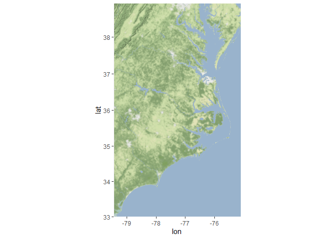<!-- -->


```r
ggmap(cap_map_base) + 
  geom_point(data = turtles3, aes(Cap_Longitude,Cap_Latitude,color=Species,shape=dead_alive_new), size = 2, alpha = 0.7) +
           labs(x = "Longitude", y = "Latitude", title = "Capture Locations")
```

```
## Warning: Removed 1 rows containing missing values (geom_point).
```

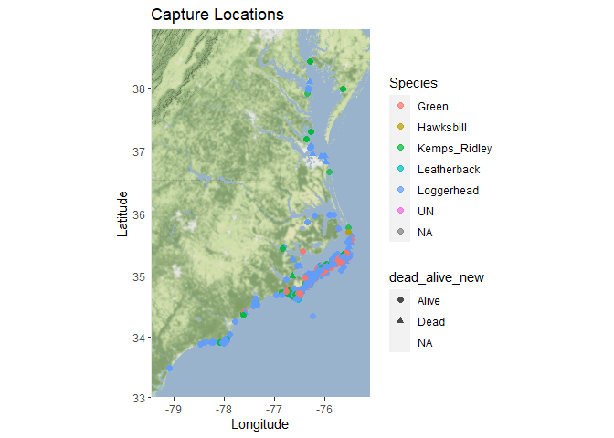<!-- -->

```r
turtles3%>%
  select(Rel_Latitude,Rel_Longitude)%>%
  summary()
```

```
##   Rel_Latitude   Rel_Longitude   
##  Min.   :27.82   Min.   :-81.24  
##  1st Qu.:34.83   1st Qu.:-76.38  
##  Median :34.89   Median :-76.33  
##  Mean   :34.92   Mean   :-76.26  
##  3rd Qu.:35.04   3rd Qu.:-76.12  
##  Max.   :39.00   Max.   :-36.03  
##  NA's   :351     NA's   :353
```


```r
rel_lat <- c(27.82, 39)
rel_long <- c(-81.24, -36.03)
bbox2 <- make_bbox(rel_long, rel_lat, f = 0.05)
```


```r
rel_map_base <- get_map(bbox2, maptype = "terrain-background", source = "stamen")
```

```
## Map tiles by Stamen Design, under CC BY 3.0. Data by OpenStreetMap, under ODbL.
```

```r
ggmap(rel_map_base)
```

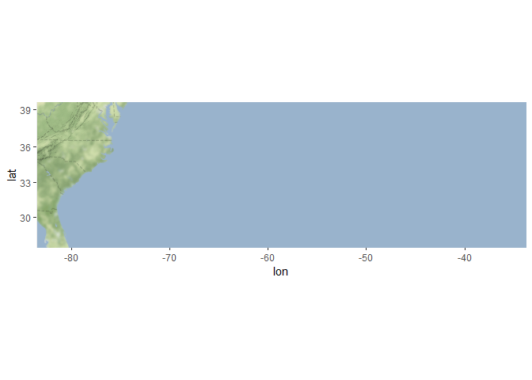<!-- -->

```r
ggmap(rel_map_base) + 
  geom_point(data = turtles3, aes(Rel_Longitude,Rel_Latitude,color=Species), size = 2, alpha = 0.7) +
           labs(x = "Longitude", y = "Latitude", title = "Release Locations")
```

```
## Warning: Removed 353 rows containing missing values (geom_point).
```

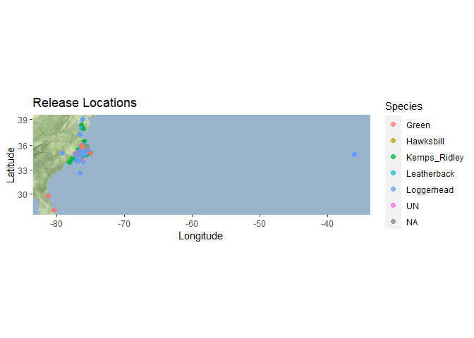<!-- -->
#we can then make additional maps with color or shape of the dots for different variables. We also should pick a unifying color scheme/text/chart and map theme for all of our images (Ideally a color that stands out against the terrain background if we want to stick with terrain for our maps)

#The following are some ideas for graphs that I thought would be good to include, but we can each come up and explore some of our own to compile into the final product


```r
turtles3%>%
  group_by(year)%>%
  summarise(n())
```

```
## # A tibble: 28 x 2
##     year `n()`
##  * <int> <int>
##  1  1988   154
##  2  1989    82
##  3  1990    18
##  4  1991    17
##  5  1992    50
##  6  1993    22
##  7  1994   193
##  8  1995   464
##  9  1996   500
## 10  1997   463
## # ... with 18 more rows
```

```r
turtles3%>%
  group_by(year)%>%
  ggplot(aes(x=year,fill=dead_alive_new))+
  geom_bar(position = "dodge")
```

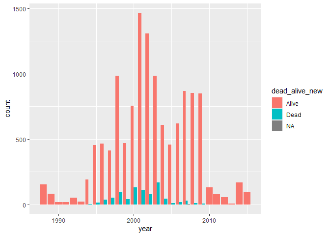<!-- -->


```r
turtles3%>%
  group_by(Capture_month)%>%
  summarise(n())
```

```
## # A tibble: 12 x 2
##    Capture_month `n()`
##  *         <dbl> <int>
##  1             1    41
##  2             2     9
##  3             3     8
##  4             4    15
##  5             5   945
##  6             6  1567
##  7             7  1556
##  8             8  1201
##  9             9   918
## 10            10  2735
## 11            11  4106
## 12            12   334
```

```r
turtles3%>%
  ggplot(aes(month(x=DateCapture_new,label=TRUE)))+
  geom_bar(position = "dodge")+
  labs(x = NULL,
         y = "Number of Captures")
```

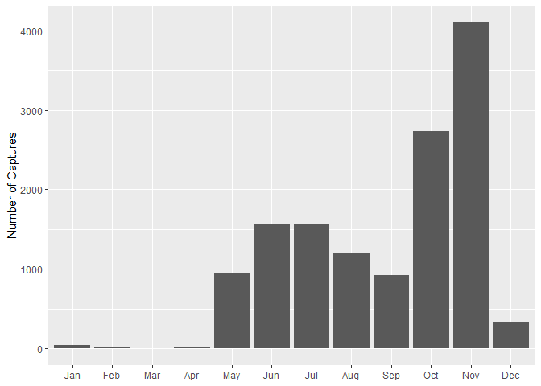<!-- -->


```r
turtles3%>%
  group_by(Capture_day)%>%
  summarise(n())
```

```
## # A tibble: 31 x 2
##    Capture_day `n()`
##  *       <int> <int>
##  1           1   432
##  2           2   415
##  3           3   222
##  4           4   383
##  5           5   445
##  6           6   469
##  7           7   487
##  8           8   374
##  9           9   458
## 10          10   586
## # ... with 21 more rows
```


```r
turtles3%>%
  ggplot(aes(day(x=DateCapture_new)))+
  geom_bar()+
  labs(x = NULL,
         y = "Number of Captures")
```

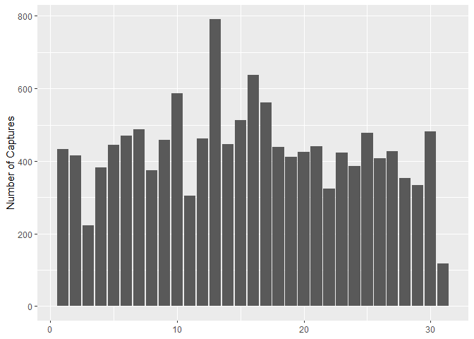<!-- -->


```r
turtles3%>%
  group_by(capture_week_day)%>%
  summarise(n())
```

```
## # A tibble: 7 x 2
##   capture_week_day `n()`
## *            <dbl> <int>
## 1                1   352
## 2                2  3530
## 3                3  2315
## 4                4  1574
## 5                5  1590
## 6                6  3613
## 7                7   461
```

```r
turtles3%>%
  ggplot(aes(wday(x=DateCapture_new,label=TRUE)))+
  geom_bar()+
  labs(x = NULL,
         y = "Number of Captures")
```

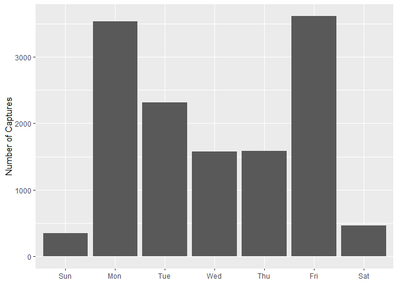<!-- -->
#Monday and Friday are popular trapping days apparently


```r
turtles3%>%
  group_by(year)%>%
  mutate(mean_body_length=mean(SCL_tip,na.rm=T))%>%
  ggplot(aes(x=year,y=mean_body_length,group=1,color=Species))+
  geom_line()+
  geom_point()+
  facet_wrap(~Species)
```

```
## geom_path: Each group consists of only one observation. Do you need to adjust
## the group aesthetic?
```

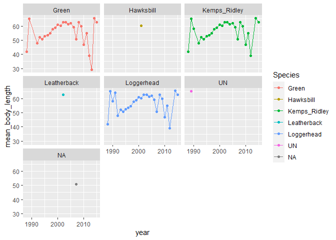<!-- -->

```r
turtles3%>%
  ggplot(aes(x=Species,y=CCL_tip,color=Species))+
  geom_boxplot()
```

```
## Warning: Removed 3383 rows containing non-finite values (stat_boxplot).
```

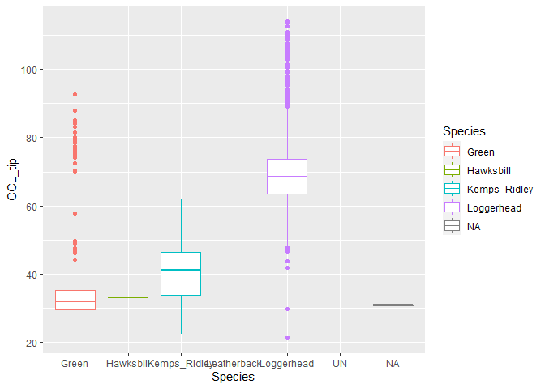<!-- -->
#we of course can fix the axis and replicate this kind of graph for other measurements (SCL_noth/SCl_tip, CCl_notch, etc)


```r
turtles3%>%
  filter(Gear!=""&Species!="")%>%
  ggplot(aes(x=Gear,fill=Species))+
  geom_bar(position = "dodge")+
  labs(title = "Gear used for Different Species",x="Gear",y="Number Captured with Given Method")+
  theme(axis.text.x = element_text(angle = 60,hjust = 1))+
  scale_y_log10()
```

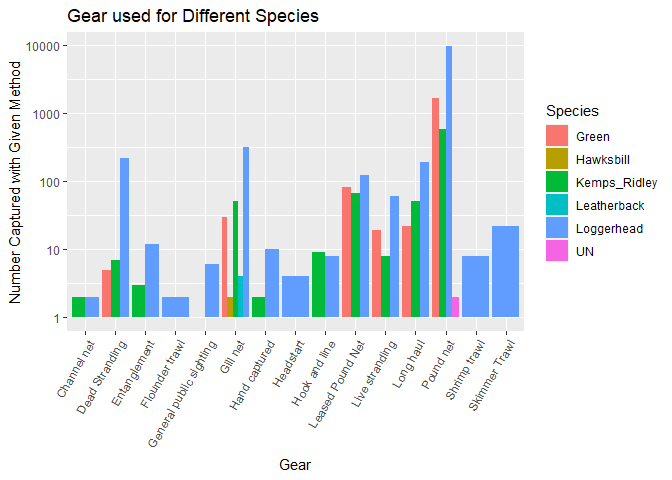<!-- -->

