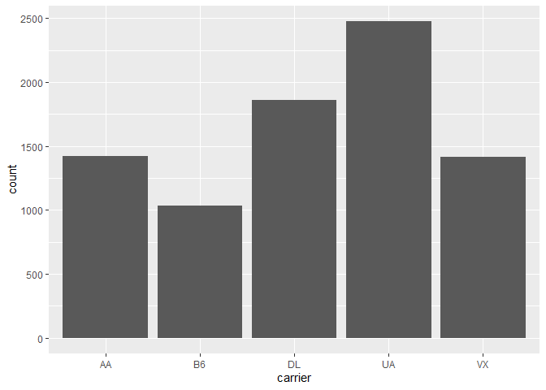

 Install Packages

```r
options(repos = c(CRAN = "http://cran.rstudio.com"))
install.packages("tidyverse")
```

```
## Installing package into 'C:/Users/ericc/Documents/R/win-library/4.0'
## (as 'lib' is unspecified)
```

```
## also installing the dependencies 'pkgbuild', 'diffobj', 'rematch2', 'brio', 'desc', 'pkgload', 'praise', 'ps', 'waldo', 'colorspace', 'sys', 'testthat', 'farver', 'labeling', 'munsell', 'RColorBrewer', 'viridisLite', 'askpass', 'rematch', 'prettyunits', 'processx', 'backports', 'ellipsis', 'generics', 'assertthat', 'fansi', 'DBI', 'lifecycle', 'R6', 'tidyselect', 'blob', 'withr', 'vctrs', 'gtable', 'isoband', 'scales', 'pkgconfig', 'curl', 'openssl', 'utf8', 'clipr', 'BH', 'cpp11', 'cellranger', 'progress', 'callr', 'fs', 'whisker', 'selectr', 'broom', 'cli', 'crayon', 'dbplyr', 'dplyr', 'forcats', 'ggplot2', 'haven', 'hms', 'httr', 'lubridate', 'modelr', 'pillar', 'purrr', 'readr', 'readxl', 'reprex', 'rstudioapi', 'rvest', 'tibble', 'tidyr', 'xml2'
```

```
## 
##   There are binary versions available but the source versions are later:
##           binary source needs_compilation
## backports  1.2.0  1.2.1              TRUE
## ggplot2    3.3.2  3.3.3             FALSE
## 
##   Binaries will be installed
## package 'pkgbuild' successfully unpacked and MD5 sums checked
## package 'diffobj' successfully unpacked and MD5 sums checked
## package 'rematch2' successfully unpacked and MD5 sums checked
## package 'brio' successfully unpacked and MD5 sums checked
## package 'desc' successfully unpacked and MD5 sums checked
## package 'pkgload' successfully unpacked and MD5 sums checked
## package 'praise' successfully unpacked and MD5 sums checked
## package 'ps' successfully unpacked and MD5 sums checked
## package 'waldo' successfully unpacked and MD5 sums checked
## package 'colorspace' successfully unpacked and MD5 sums checked
## package 'sys' successfully unpacked and MD5 sums checked
## package 'testthat' successfully unpacked and MD5 sums checked
## package 'farver' successfully unpacked and MD5 sums checked
## package 'labeling' successfully unpacked and MD5 sums checked
## package 'munsell' successfully unpacked and MD5 sums checked
## package 'RColorBrewer' successfully unpacked and MD5 sums checked
## package 'viridisLite' successfully unpacked and MD5 sums checked
## package 'askpass' successfully unpacked and MD5 sums checked
## package 'rematch' successfully unpacked and MD5 sums checked
## package 'prettyunits' successfully unpacked and MD5 sums checked
## package 'processx' successfully unpacked and MD5 sums checked
## package 'backports' successfully unpacked and MD5 sums checked
## package 'ellipsis' successfully unpacked and MD5 sums checked
## package 'generics' successfully unpacked and MD5 sums checked
## package 'assertthat' successfully unpacked and MD5 sums checked
## package 'fansi' successfully unpacked and MD5 sums checked
## package 'DBI' successfully unpacked and MD5 sums checked
## package 'lifecycle' successfully unpacked and MD5 sums checked
## package 'R6' successfully unpacked and MD5 sums checked
## package 'tidyselect' successfully unpacked and MD5 sums checked
## package 'blob' successfully unpacked and MD5 sums checked
## package 'withr' successfully unpacked and MD5 sums checked
## package 'vctrs' successfully unpacked and MD5 sums checked
## package 'gtable' successfully unpacked and MD5 sums checked
## package 'isoband' successfully unpacked and MD5 sums checked
## package 'scales' successfully unpacked and MD5 sums checked
## package 'pkgconfig' successfully unpacked and MD5 sums checked
## package 'curl' successfully unpacked and MD5 sums checked
## package 'openssl' successfully unpacked and MD5 sums checked
## package 'utf8' successfully unpacked and MD5 sums checked
## package 'clipr' successfully unpacked and MD5 sums checked
## package 'BH' successfully unpacked and MD5 sums checked
## package 'cpp11' successfully unpacked and MD5 sums checked
## package 'cellranger' successfully unpacked and MD5 sums checked
## package 'progress' successfully unpacked and MD5 sums checked
## package 'callr' successfully unpacked and MD5 sums checked
## package 'fs' successfully unpacked and MD5 sums checked
## package 'whisker' successfully unpacked and MD5 sums checked
## package 'selectr' successfully unpacked and MD5 sums checked
## package 'broom' successfully unpacked and MD5 sums checked
## package 'cli' successfully unpacked and MD5 sums checked
## package 'crayon' successfully unpacked and MD5 sums checked
## package 'dbplyr' successfully unpacked and MD5 sums checked
## package 'dplyr' successfully unpacked and MD5 sums checked
## package 'forcats' successfully unpacked and MD5 sums checked
## package 'haven' successfully unpacked and MD5 sums checked
## package 'hms' successfully unpacked and MD5 sums checked
## package 'httr' successfully unpacked and MD5 sums checked
## package 'lubridate' successfully unpacked and MD5 sums checked
## package 'modelr' successfully unpacked and MD5 sums checked
## package 'pillar' successfully unpacked and MD5 sums checked
## package 'purrr' successfully unpacked and MD5 sums checked
## package 'readr' successfully unpacked and MD5 sums checked
## package 'readxl' successfully unpacked and MD5 sums checked
## package 'reprex' successfully unpacked and MD5 sums checked
## package 'rstudioapi' successfully unpacked and MD5 sums checked
## package 'rvest' successfully unpacked and MD5 sums checked
## package 'tibble' successfully unpacked and MD5 sums checked
## package 'tidyr' successfully unpacked and MD5 sums checked
## package 'xml2' successfully unpacked and MD5 sums checked
## package 'tidyverse' successfully unpacked and MD5 sums checked
## 
## The downloaded binary packages are in
## 	C:\Users\ericc\AppData\Local\Temp\Rtmpkvgago\downloaded_packages
```

```
## installing the source package 'ggplot2'
```

```r
install.packages("nycflights13")
```

```
## Installing package into 'C:/Users/ericc/Documents/R/win-library/4.0'
## (as 'lib' is unspecified)
```

```
## package 'nycflights13' successfully unpacked and MD5 sums checked
## 
## The downloaded binary packages are in
## 	C:\Users\ericc\AppData\Local\Temp\Rtmpkvgago\downloaded_packages
```

## Working directory

```r
getwd()
```

```
## [1] "C:/Users/ericc/Desktop/BIS15W2021_ecoyle/lab1"
```

## Session Info

```r
sessionInfo()
```

```
## R version 4.0.3 (2020-10-10)
## Platform: x86_64-w64-mingw32/x64 (64-bit)
## Running under: Windows 10 x64 (build 19041)
## 
## Matrix products: default
## 
## locale:
## [1] LC_COLLATE=English_United States.1252 
## [2] LC_CTYPE=English_United States.1252   
## [3] LC_MONETARY=English_United States.1252
## [4] LC_NUMERIC=C                          
## [5] LC_TIME=English_United States.1252    
## 
## attached base packages:
## [1] stats     graphics  grDevices utils     datasets  methods   base     
## 
## loaded via a namespace (and not attached):
##  [1] compiler_4.0.3  magrittr_2.0.1  tools_4.0.3     htmltools_0.5.0
##  [5] yaml_2.2.1      stringi_1.5.3   rmarkdown_2.6   knitr_1.30     
##  [9] stringr_1.4.0   xfun_0.19       digest_0.6.27   rlang_0.4.9    
## [13] evaluate_0.14
```

## Load the libraries

```r
library(nycflights13)
library(tidyverse)
```

```
## -- Attaching packages --------------------------------------- tidyverse 1.3.0 --
```

```
## v ggplot2 3.3.3     v purrr   0.3.4
## v tibble  3.0.4     v dplyr   1.0.2
## v tidyr   1.1.2     v stringr 1.4.0
## v readr   1.4.0     v forcats 0.5.0
```

```
## -- Conflicts ------------------------------------------ tidyverse_conflicts() --
## x dplyr::filter() masks stats::filter()
## x dplyr::lag()    masks stats::lag()
```

## nycflights13

```r
flights
```

```
## # A tibble: 336,776 x 19
##     year month   day dep_time sched_dep_time dep_delay arr_time sched_arr_time
##    <int> <int> <int>    <int>          <int>     <dbl>    <int>          <int>
##  1  2013     1     1      517            515         2      830            819
##  2  2013     1     1      533            529         4      850            830
##  3  2013     1     1      542            540         2      923            850
##  4  2013     1     1      544            545        -1     1004           1022
##  5  2013     1     1      554            600        -6      812            837
##  6  2013     1     1      554            558        -4      740            728
##  7  2013     1     1      555            600        -5      913            854
##  8  2013     1     1      557            600        -3      709            723
##  9  2013     1     1      557            600        -3      838            846
## 10  2013     1     1      558            600        -2      753            745
## # ... with 336,766 more rows, and 11 more variables: arr_delay <dbl>,
## #   carrier <chr>, flight <int>, tailnum <chr>, origin <chr>, dest <chr>,
## #   air_time <dbl>, distance <dbl>, hour <dbl>, minute <dbl>, time_hour <dttm>
```

## Filter
Flights between JFK and SFO airports.

```r
flights %>% 
  filter(origin=="JFK" & dest=="SFO")
```

```
## # A tibble: 8,204 x 19
##     year month   day dep_time sched_dep_time dep_delay arr_time sched_arr_time
##    <int> <int> <int>    <int>          <int>     <dbl>    <int>          <int>
##  1  2013     1     1      611            600        11      945            931
##  2  2013     1     1      655            700        -5     1037           1045
##  3  2013     1     1      729            730        -1     1049           1115
##  4  2013     1     1      734            737        -3     1047           1113
##  5  2013     1     1      745            745         0     1135           1125
##  6  2013     1     1      803            800         3     1132           1144
##  7  2013     1     1     1029           1030        -1     1427           1355
##  8  2013     1     1     1031           1030         1     1353           1415
##  9  2013     1     1     1112           1100        12     1440           1438
## 10  2013     1     1     1124           1100        24     1435           1431
## # ... with 8,194 more rows, and 11 more variables: arr_delay <dbl>,
## #   carrier <chr>, flight <int>, tailnum <chr>, origin <chr>, dest <chr>,
## #   air_time <dbl>, distance <dbl>, hour <dbl>, minute <dbl>, time_hour <dttm>
```

##Plot
Count of flights between JFK and SFO airports by carrier.

```r
flights %>% 
  filter(origin=="JFK" & dest=="SFO") %>% 
  ggplot(aes(x=carrier))+
  geom_bar()
```

<!-- -->
