## Learning Goals
*At the end of this exercise, you will be able to:*    
1. Build histograms and density plots.
2. Adjust colors using R's built-in color options.  
3. Create new categories with `case_when()` and use those categories to build plots.  
4. Build line plots.  

## Group project  
Please make sure that you have 1-2 data sets to share with your group member during part 2 of today's lab. You need to decide which of the data sets you will use for your project.  

## Resources
- [ggplot2 cheatsheet](https://www.rstudio.com/wp-content/uploads/2015/03/ggplot2-cheatsheet.pdf)
- [R for Data Science](https://r4ds.had.co.nz/)
- [R Cookbook](http://www.cookbook-r.com/)
- [`ggplot` themes](https://ggplot2.tidyverse.org/reference/ggtheme.html)
- [Rebecca Barter `ggplot` Tutorial](http://www.rebeccabarter.com/blog/2017-11-17-ggplot2_tutorial/)
- [R Color Brewer](http://colorbrewer2.org/#type=sequential&scheme=BuGn&n=3)

## Install `RColorBrewer` and `paletteer`
`RColorBrewer` and `paletteer` are helpful in selecting palettes of color that work with your data. Please install these now, we will work with them in part 2 of today's lab.

```r
#install.packages("RColorBrewer")
#install.packages("paletteer")
```

## Load the libraries

```r
library(tidyverse)
library(RColorBrewer)
library(paletteer)
library(janitor)
library(here)
```


```r
options(scipen=999) #cancels the use of scientific notation for the session
```

## Data
For this tutorial, we will use two data sets.  

[Desert ecology](http://esapubs.org/archive/ecol/E090/118/). The data are from: S. K. Morgan Ernest, Thomas J. Valone, and James H. Brown. 2009. Long-term monitoring and experimental manipulation of a Chihuahuan Desert ecosystem near Portal, Arizona, USA. Ecology 90:1708.  

```r
deserts <- read_csv(here("lab11", "data", "surveys_complete.csv"))
```

[Homerange](http://datadryad.org/resource/doi:10.5061/dryad.q5j65/1). The data are from: Tamburello N, Cote IM, Dulvy NK (2015) Energy and the scaling of animal space use. The American Naturalist 186(2):196-211. http://dx.doi.org/10.1086/682070.  

```r
homerange <- read_csv(here("lab11", "data", "Tamburelloetal_HomeRangeDatabase.csv"))
```

## Line plots
Line plots are great when you need to show changes over time. Here we look at the number of samples for species DM and DS over the years represented in the data.  

```r
deserts %>% 
  filter(species_id=="DM" | species_id=="DS") %>% 
  group_by(year, species_id) %>% 
  summarise(n=n())
```

```
## `summarise()` has grouped output by 'year'. You can override using the `.groups` argument.
```

```
## # A tibble: 47 x 3
## # Groups:   year [26]
##     year species_id     n
##    <dbl> <chr>      <int>
##  1  1977 DM           264
##  2  1977 DS            98
##  3  1978 DM           389
##  4  1978 DS           320
##  5  1979 DM           209
##  6  1979 DS           204
##  7  1980 DM           493
##  8  1980 DS           346
##  9  1981 DM           559
## 10  1981 DS           354
## # ... with 37 more rows
```


```r
deserts$year <- as.factor(deserts$year)
```


```r
deserts %>% 
  filter(species_id=="DM" | species_id=="DS") %>% 
  group_by(year, species_id) %>% 
  summarise(n=n()) %>% 
  ggplot(aes(x=year, y=n, group=species_id, color=species_id))+
  geom_line()+
  geom_point(shape=1)+
  theme(axis.text.x = element_text(angle = 60, hjust = 1))+
  labs(title = "Number of samples for species DM",
       x = "Year",
       fill = "n")
```

```
## `summarise()` has grouped output by 'year'. You can override using the `.groups` argument.
```

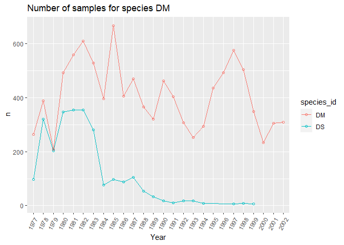<!-- -->

## Histograms
Histograms are frequently used by biologists; they show the distribution of continuous variables. As students, you almost certainly have seen histograms of grade distributions. Without getting into the statistics, a histogram `bins` the data and you specify the number of bins that encompass a range of observations. For something like grades, this is easy because the number of bins corresponds to the grades A-F. By default, R uses a formula to calculate the number of bins but some adjustment is often required.  

What does the distribution of body mass look like in the `homerange` data?

```r
homerange %>% 
  ggplot(aes(x = log10.mass)) +
  geom_histogram(alpha = 0.6, color = "red", fill = "deeppink4", bins=40)+
  labs(title = "Distribution of Body Mass")
```

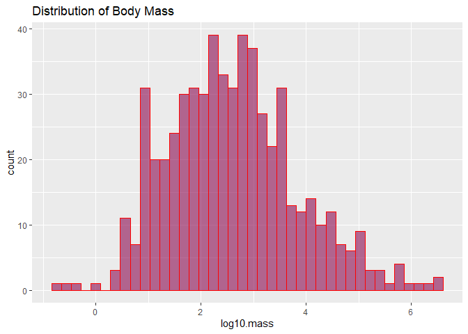<!-- -->

Let's play with the colors. This shows all 657 of R's built-in colors. Notice that `color` and `fill` do different things!

```r
#grDevices::colors()
```

## Density plots  
Density plots are similar to histograms but they use a smoothing function to make the distribution more even and clean looking. They do not use bins.

```r
homerange %>% 
  ggplot(aes(x = log10.mass)) +
  geom_density(fill="steelblue", alpha  =.6, color = "black")+
  labs(title = "Distribution of Body Mass")
```

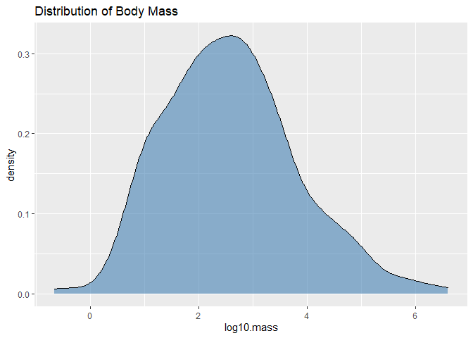<!-- -->

I like to see both the histogram and the density curve so I often plot them together. Note that I assign the density plot a different color.

```r
homerange %>% 
  ggplot(aes(x=log10.mass)) +
  geom_histogram(aes(y = ..density..), binwidth = .4, fill = "steelblue", alpha = 0.8, color = "black")+
  geom_density(color = "red")+
  labs(title = "Distribution of Body Mass")
```

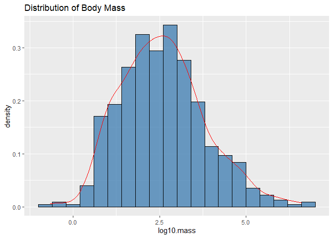<!-- -->

## Practice
1. Make a histogram of `log10.hra`. Make sure to add a title.

```r
homerange %>% 
  ggplot(aes(x = log10.hra)) +
  geom_histogram(alpha = 0.6, color = "orange", fill = "black", bins=30)+
  labs(title = "Distribution of Home Range Size")
```

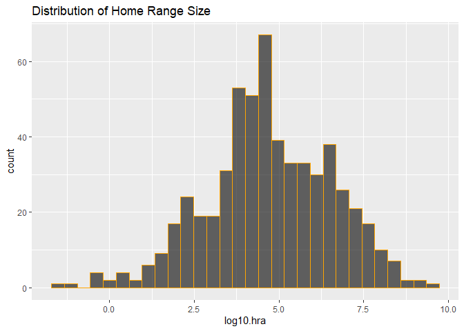<!-- -->

2. Now plot the same variable using `geom_density()`.

```r
homerange %>% 
  ggplot(aes(x = log10.hra)) +
  geom_density(alpha = 0.6, color = "orange", fill = "black")+
  labs(title = "Distribution of Home Range Size")
```

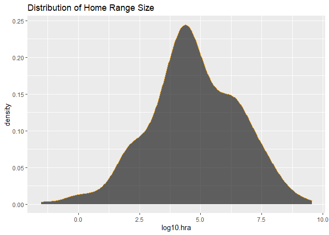<!-- -->

3. Combine them both!

```r
homerange %>% 
  ggplot(aes(x=log10.hra)) +
  geom_histogram(aes(y = ..density..), binwidth = .4, fill = "purple", alpha = 0.8, color = "green")+
  geom_density(color = "black")+
  labs(title = "Distribution of Home Range Size")
```

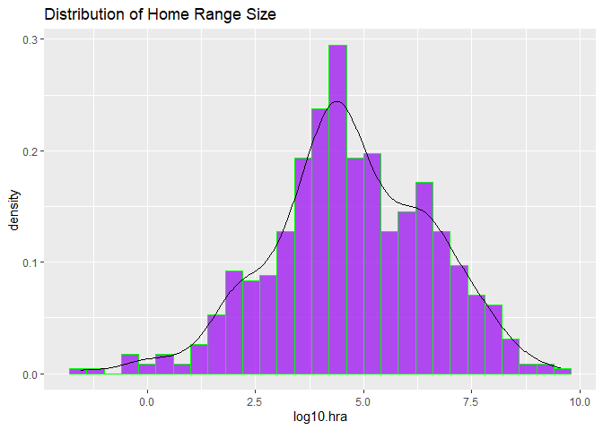<!-- -->

## Create Categories with mutate and case_when()
`case_when()` is a very handy function from `dplyr` which allows us to calculate a new variable from other variables. We use `case_when()` within `mutate()` to do this.`case_when()` allows us to specify multiple conditions. Let's reclassify the body mass variable into a new factor variable with small, medium, and large animals. 

```r
glimpse(homerange)
```

```
## Rows: 569
## Columns: 24
## $ taxon                      <chr> "lake fishes", "river fishes", "river fi...
## $ common.name                <chr> "american eel", "blacktail redhorse", "c...
## $ class                      <chr> "actinopterygii", "actinopterygii", "act...
## $ order                      <chr> "anguilliformes", "cypriniformes", "cypr...
## $ family                     <chr> "anguillidae", "catostomidae", "cyprinid...
## $ genus                      <chr> "anguilla", "moxostoma", "campostoma", "...
## $ species                    <chr> "rostrata", "poecilura", "anomalum", "fu...
## $ primarymethod              <chr> "telemetry", "mark-recapture", "mark-rec...
## $ N                          <chr> "16", NA, "20", "26", "17", "5", "2", "2...
## $ mean.mass.g                <dbl> 887.00, 562.00, 34.00, 4.00, 4.00, 3525....
## $ log10.mass                 <dbl> 2.9479236, 2.7497363, 1.5314789, 0.60206...
## $ alternative.mass.reference <chr> NA, NA, NA, NA, NA, NA, NA, NA, NA, NA, ...
## $ mean.hra.m2                <dbl> 282750.00, 282.10, 116.11, 125.50, 87.10...
## $ log10.hra                  <dbl> 5.4514026, 2.4504031, 2.0648696, 2.09864...
## $ hra.reference              <chr> "Minns, C. K. 1995. Allometry of home ra...
## $ realm                      <chr> "aquatic", "aquatic", "aquatic", "aquati...
## $ thermoregulation           <chr> "ectotherm", "ectotherm", "ectotherm", "...
## $ locomotion                 <chr> "swimming", "swimming", "swimming", "swi...
## $ trophic.guild              <chr> "carnivore", "carnivore", "carnivore", "...
## $ dimension                  <chr> "3D", "2D", "2D", "2D", "2D", "2D", "2D"...
## $ preymass                   <dbl> NA, NA, NA, NA, NA, NA, 1.39, NA, NA, NA...
## $ log10.preymass             <dbl> NA, NA, NA, NA, NA, NA, 0.1430148, NA, N...
## $ PPMR                       <dbl> NA, NA, NA, NA, NA, NA, 530, NA, NA, NA,...
## $ prey.size.reference        <chr> NA, NA, NA, NA, NA, NA, "Brose U, et al....
```


```r
homerange %>% 
  select(log10.mass) %>% 
  summarise(min=min(log10.mass),
            max=max(log10.mass))
```

```
## # A tibble: 1 x 2
##      min   max
##    <dbl> <dbl>
## 1 -0.658  6.60
```


```r
homerange <- homerange %>% 
             mutate(mass_category = case_when(log10.mass <= 1.75 ~ "small",
                                              log10.mass > 1.75 & log10.mass <= 2.75 ~ "medium",
                                              log10.mass > 2.75 ~ "large"))
```

Here we check how the newly created body mass categories compare across `trophic.guild`. 

```r
homerange %>% 
  ggplot(aes(x = mass_category, fill = trophic.guild)) +
  geom_bar() +
  coord_flip() +
  labs(title = "Observations by Taxon and Mass Category in Homerange Data",
       x = "Mass Category",
       fill = "Trophic Guild")
```

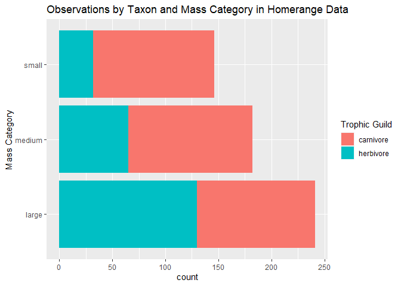<!-- -->

## Practice
1. Use case_when() to make a new column `range_category` that breaks down `log10.hra` into very small, small, medium, and large classes based on quartile.

```r
homerange%>%
  summary(log10.hra)
```

```
##     taxon           common.name           class              order          
##  Length:569         Length:569         Length:569         Length:569        
##  Class :character   Class :character   Class :character   Class :character  
##  Mode  :character   Mode  :character   Mode  :character   Mode  :character  
##                                                                             
##                                                                             
##                                                                             
##                                                                             
##     family             genus             species          primarymethod     
##  Length:569         Length:569         Length:569         Length:569        
##  Class :character   Class :character   Class :character   Class :character  
##  Mode  :character   Mode  :character   Mode  :character   Mode  :character  
##                                                                             
##                                                                             
##                                                                             
##                                                                             
##       N              mean.mass.g        log10.mass     
##  Length:569         Min.   :      0   Min.   :-0.6576  
##  Class :character   1st Qu.:     50   1st Qu.: 1.6990  
##  Mode  :character   Median :    330   Median : 2.5185  
##                     Mean   :  34602   Mean   : 2.5947  
##                     3rd Qu.:   2150   3rd Qu.: 3.3324  
##                     Max.   :4000000   Max.   : 6.6021  
##                                                        
##  alternative.mass.reference  mean.hra.m2           log10.hra     
##  Length:569                 Min.   :         0   Min.   :-1.523  
##  Class :character           1st Qu.:      4500   1st Qu.: 3.653  
##  Mode  :character           Median :     39344   Median : 4.595  
##                             Mean   :  21456509   Mean   : 4.709  
##                             3rd Qu.:   1038100   3rd Qu.: 6.016  
##                             Max.   :3550830977   Max.   : 9.550  
##                                                                  
##  hra.reference         realm           thermoregulation    locomotion       
##  Length:569         Length:569         Length:569         Length:569        
##  Class :character   Class :character   Class :character   Class :character  
##  Mode  :character   Mode  :character   Mode  :character   Mode  :character  
##                                                                             
##                                                                             
##                                                                             
##                                                                             
##  trophic.guild       dimension            preymass         log10.preymass   
##  Length:569         Length:569         Min.   :     0.67   Min.   :-0.1739  
##  Class :character   Class :character   1st Qu.:    20.02   1st Qu.: 1.3014  
##  Mode  :character   Mode  :character   Median :    53.75   Median : 1.7304  
##                                        Mean   :  3989.88   Mean   : 2.0188  
##                                        3rd Qu.:   363.35   3rd Qu.: 2.5603  
##                                        Max.   :130233.20   Max.   : 5.1147  
##                                        NA's   :502         NA's   :502      
##       PPMR         prey.size.reference mass_category     
##  Min.   :  0.380   Length:569          Length:569        
##  1st Qu.:  3.315   Class :character    Class :character  
##  Median :  7.190   Mode  :character    Mode  :character  
##  Mean   : 31.752                                         
##  3rd Qu.: 15.966                                         
##  Max.   :530.000                                         
##  NA's   :502
```

```r
#install.packages("gtools")
```

```r
library(gtools)
quartiles<-quantcut(homerange$log10.hra)
tabyl(quartiles)
```

```
##     quartiles   n   percent
##  [-1.52,3.65] 143 0.2513181
##   (3.65,4.59] 142 0.2495606
##   (4.59,6.02] 142 0.2495606
##   (6.02,9.55] 142 0.2495606
```


```r
homerange <- homerange %>% 
             mutate(range_category = case_when(log10.hra<=3.65 ~ "very small",
                                               log10.hra > 3.65 & log10.hra <= 4.59 ~"small",
                                              log10.hra > 4.59 & log10.hra <= 6.02 ~ "medium",
                                              log10.hra > 6.02 ~ "large"))
```


```r
homerange %>% 
  ggplot(aes(x = range_category, fill = trophic.guild)) +
  geom_bar() +
  coord_flip() +
  labs(title = "Observations by Taxon and Range Category in Homerange Data",
       x = "Range Category",
       fill = "Trophic Guild")
```

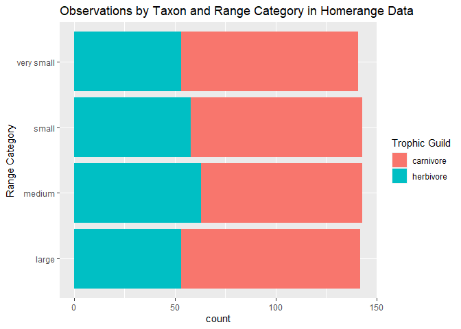<!-- -->

2. How many and which taxonomic classes are represented in each of the `range_category` classes?

```r
homerange %>% 
  ggplot(aes(x = range_category, fill = taxon)) +
  geom_bar() +
  coord_flip() +
  labs(title = "Observations by Taxon and Range Category in Homerange Data",
       x = "Range Category",
       fill = "Taxonomic Class")
```

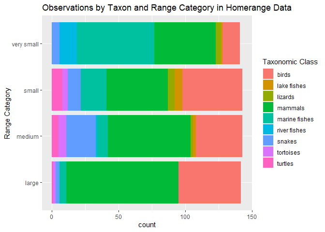<!-- -->

```r
Small_range<-homerange%>%
  filter(range_category=="small")
Small_range
```

```
## # A tibble: 143 x 26
##    taxon common.name class order family genus species primarymethod N    
##    <chr> <chr>       <chr> <chr> <chr>  <chr> <chr>   <chr>         <chr>
##  1 mari~ pollack     acti~ gadi~ gadid~ poll~ pollac~ telemetry     2    
##  2 mari~ orangespin~ acti~ perc~ acant~ naso  litura~ telemetry     8    
##  3 mari~ bluespine ~ acti~ perc~ acant~ naso  unicor~ telemetry     7    
##  4 lake~ rock bass   acti~ perc~ centr~ ambl~ rupest~ mark-recaptu~ 16   
##  5 lake~ pumpkinseed acti~ perc~ centr~ lepo~ gibbos~ telemetry     4    
##  6 lake~ largemouth~ acti~ perc~ centr~ micr~ salmoi~ telemetry     9    
##  7 mari~ bermuda ch~ acti~ perc~ kypho~ kyph~ sectat~ telemetry     11   
##  8 mari~ california~ acti~ perc~ labri~ semi~ pulcher telemetry     16   
##  9 mari~ schoolmast~ acti~ perc~ lutja~ lutj~ apodus  telemetry     15   
## 10 mari~ gray snapp~ acti~ perc~ lutja~ lutj~ griseus telemetry     14   
## # ... with 133 more rows, and 17 more variables: mean.mass.g <dbl>,
## #   log10.mass <dbl>, alternative.mass.reference <chr>, mean.hra.m2 <dbl>,
## #   log10.hra <dbl>, hra.reference <chr>, realm <chr>, thermoregulation <chr>,
## #   locomotion <chr>, trophic.guild <chr>, dimension <chr>, preymass <dbl>,
## #   log10.preymass <dbl>, PPMR <dbl>, prey.size.reference <chr>,
## #   mass_category <chr>, range_category <chr>
```

3. Isolate the small `range_category` and plot the range of `log10.mass` by taxonomic class.

```r
Small_range%>%
  ggplot(aes(x=taxon,y=log10.mass,color=taxon))+
  geom_boxplot()+
  labs(title="Mass by Taxonomic Class of Animals with Small Ranges",x="Taxon",y="Mass")
```

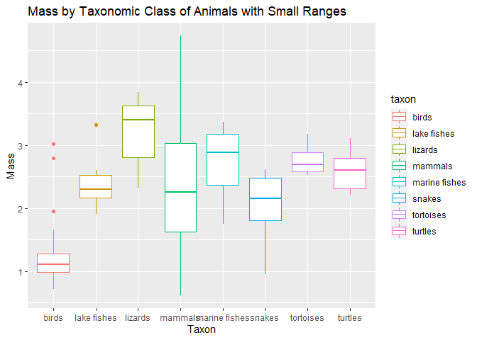<!-- -->

## That's it! Take a break and I will see you on Zoom!  

-->[Home](https://jmledford3115.github.io/datascibiol/)
