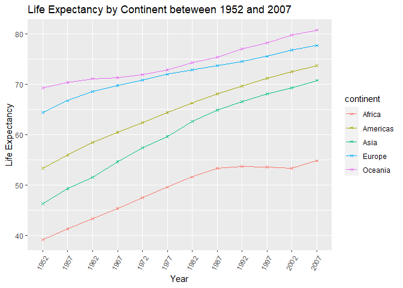

## Instructions
Answer the following questions and complete the exercises in RMarkdown. Please embed all of your code and push your final work to your repository. Your final lab report should be organized, clean, and run free from errors. Remember, you must remove the `#` for the included code chunks to run. Be sure to add your name to the author header above. For any included plots, make sure they are clearly labeled. You are free to use any plot type that you feel best communicates the results of your analysis.  

**In this homework, you should make use of the aesthetics you have learned. It's OK to be flashy!**

Make sure to use the formatting conventions of RMarkdown to make your report neat and clean!  

## Load the libraries

```r
library(tidyverse)
library(janitor)
library(here)
library(naniar)
```

## Resources
The idea for this assignment came from [Rebecca Barter's](http://www.rebeccabarter.com/blog/2017-11-17-ggplot2_tutorial/) ggplot tutorial so if you get stuck this is a good place to have a look.  

## Gapminder
For this assignment, we are going to use the dataset [gapminder](https://cran.r-project.org/web/packages/gapminder/index.html). Gapminder includes information about economics, population, and life expectancy from countries all over the world. You will need to install it before use. This is the same data that we will use for midterm 2 so this is good practice.

```r
#install.packages("gapminder")
library("gapminder")
```

## Questions
The questions below are open-ended and have many possible solutions. Your approach should, where appropriate, include numerical summaries and visuals. Be creative; assume you are building an analysis that you would ultimately present to an audience of stakeholders. Feel free to try out different `geoms` if they more clearly present your results.  

**1. Use the function(s) of your choice to get an idea of the overall structure of the data frame, including its dimensions, column names, variable classes, etc. As part of this, determine how NA's are treated in the data.**  

```r
glimpse(gapminder)
```

```
## Rows: 1,704
## Columns: 6
## $ country   <fct> Afghanistan, Afghanistan, Afghanistan, Afghanistan, Afgha...
## $ continent <fct> Asia, Asia, Asia, Asia, Asia, Asia, Asia, Asia, Asia, Asi...
## $ year      <int> 1952, 1957, 1962, 1967, 1972, 1977, 1982, 1987, 1992, 199...
## $ lifeExp   <dbl> 28.801, 30.332, 31.997, 34.020, 36.088, 38.438, 39.854, 4...
## $ pop       <int> 8425333, 9240934, 10267083, 11537966, 13079460, 14880372,...
## $ gdpPercap <dbl> 779.4453, 820.8530, 853.1007, 836.1971, 739.9811, 786.113...
```

```r
head(gapminder)
```

```
## # A tibble: 6 x 6
##   country     continent  year lifeExp      pop gdpPercap
##   <fct>       <fct>     <int>   <dbl>    <int>     <dbl>
## 1 Afghanistan Asia       1952    28.8  8425333      779.
## 2 Afghanistan Asia       1957    30.3  9240934      821.
## 3 Afghanistan Asia       1962    32.0 10267083      853.
## 4 Afghanistan Asia       1967    34.0 11537966      836.
## 5 Afghanistan Asia       1972    36.1 13079460      740.
## 6 Afghanistan Asia       1977    38.4 14880372      786.
```

```r
anyNA(gapminder)
```

```
## [1] FALSE
```

```r
view(gapminder)
```

**2. Among the interesting variables in gapminder is life expectancy. How has global life expectancy changed between 1952 and 2007?**

```r
life_1952<-gapminder%>%
  filter(year==1952)%>%
  summarise(global_life_expectancy=mean(lifeExp))
life_1952
```

```
## # A tibble: 1 x 1
##   global_life_expectancy
##                    <dbl>
## 1                   49.1
```

```r
life_2007<-gapminder%>%
  filter(year==2007)%>%
  summarise(global_life_expectancy=mean(lifeExp))
life_2007
```

```
## # A tibble: 1 x 1
##   global_life_expectancy
##                    <dbl>
## 1                   67.0
```


```r
gapminder%>%
  group_by(year)%>%
  summarise(global_life_expectancy=mean(lifeExp))
```

```
## # A tibble: 12 x 2
##     year global_life_expectancy
##  * <int>                  <dbl>
##  1  1952                   49.1
##  2  1957                   51.5
##  3  1962                   53.6
##  4  1967                   55.7
##  5  1972                   57.6
##  6  1977                   59.6
##  7  1982                   61.5
##  8  1987                   63.2
##  9  1992                   64.2
## 10  1997                   65.0
## 11  2002                   65.7
## 12  2007                   67.0
```

```r
gapminder$year<-as.factor(gapminder$year)
```


```r
gapminder%>%
  group_by(year)%>%
  summarise(global_life_expectancy=mean(lifeExp))%>%
  ggplot(aes(x=year,y=global_life_expectancy,group=global_life_expectancy,color=global_life_expectancy))+
  geom_line()+
  geom_point(shape=2)+
  theme(axis.text.x = element_text(angle = 60, hjust = 1))+
  labs(title = "Global Life Expectancy beteween 1952 and 2007",
       x = "Year")
```

```
## geom_path: Each group consists of only one observation. Do you need to adjust
## the group aesthetic?
```

<!-- -->

**3. How do the distributions of life expectancy compare for the years 1952 and 2007?**


```r
gapminder%>%
  filter(year==1952|year==2007)%>%
  ggplot(aes(x=year,y=lifeExp))+
  geom_boxplot()+
  theme(axis.text.x = element_text(angle = 60, hjust = 1))+
  labs(title = "Life Expectancy Range 1952 vs 2007",
       x = "Year",y="Life Expectancy")
```

<!-- -->


**4. Your answer above doesn't tell the whole story since life expectancy varies by region. Make a summary that shows the min, mean, and max life expectancy by continent for all years represented in the data.**

```r
gapminder%>%
  group_by(year,continent)%>%
  summarise(mean_life_exp=mean(lifeExp),
            max_life_exp=max(lifeExp),
            minn_life_exp=min(lifeExp))
```

```
## `summarise()` has grouped output by 'year'. You can override using the `.groups` argument.
```

```
## # A tibble: 60 x 5
## # Groups:   year [12]
##    year  continent mean_life_exp max_life_exp minn_life_exp
##    <fct> <fct>             <dbl>        <dbl>         <dbl>
##  1 1952  Africa             39.1         52.7          30  
##  2 1952  Americas           53.3         68.8          37.6
##  3 1952  Asia               46.3         65.4          28.8
##  4 1952  Europe             64.4         72.7          43.6
##  5 1952  Oceania            69.3         69.4          69.1
##  6 1957  Africa             41.3         58.1          31.6
##  7 1957  Americas           56.0         70.0          40.7
##  8 1957  Asia               49.3         67.8          30.3
##  9 1957  Europe             66.7         73.5          48.1
## 10 1957  Oceania            70.3         70.3          70.3
## # ... with 50 more rows
```

```r
gapminder%>%
  group_by(year,continent)%>%
  ggplot(aes(x=year,y=lifeExp,color=continent))+
  geom_boxplot()+
  theme(axis.text.x = element_text(angle = 60, hjust = 1))+
  labs(title = "Life Expectancy by Continent beteween 1952 and 2007",
       x = "Year")
```

<!-- -->

```r
gapminder%>%
  group_by(year,continent)%>%
  summarise(mean_life_exp=mean(lifeExp),
            max_life_exp=max(lifeExp),
            min_life_exp=min(lifeExp))%>%
  ggplot(aes(x=year,y=max_life_exp,color=continent))+
  geom_point(shape=3,size=2)+
  theme(axis.text.x = element_text(angle = 60, hjust = 1))+
  labs(title = "Max Life Expectancy by Continent beteween 1952 and 2007",
       x = "Year")
```

```
## `summarise()` has grouped output by 'year'. You can override using the `.groups` argument.
```

<!-- -->

```r
gapminder%>%
  group_by(year,continent)%>%
  summarise(mean_life_exp=mean(lifeExp),
            max_life_exp=max(lifeExp),
            min_life_exp=min(lifeExp))%>%
  ggplot(aes(x=year,y=mean_life_exp,color=continent))+
  geom_point(shape=2,size=2)+
  theme(axis.text.x = element_text(angle = 60, hjust = 1))+
  labs(title = "Mean Life Expectancy by Continent beteween 1952 and 2007",
       x = "Year")
```

```
## `summarise()` has grouped output by 'year'. You can override using the `.groups` argument.
```

<!-- -->

```r
gapminder%>%
  group_by(year,continent)%>%
  summarise(mean_life_exp=mean(lifeExp),
            max_life_exp=max(lifeExp),
            min_life_exp=min(lifeExp))%>%
  ggplot(aes(x=year,y=min_life_exp,color=continent))+
  geom_point(shape=1,size=2)+
  theme(axis.text.x = element_text(angle = 60, hjust = 1))+
  labs(title = "Min Life Expectancy by Continent beteween 1952 and 2007",
       x = "Year")
```

```
## `summarise()` has grouped output by 'year'. You can override using the `.groups` argument.
```

<!-- -->

**5. How has life expectancy changed between 1952-2007 for each continent?**

```r
gapminder%>%
  group_by(year,continent)%>%
  summarise(life_expectancy=mean(lifeExp))
```

```
## `summarise()` has grouped output by 'year'. You can override using the `.groups` argument.
```

```
## # A tibble: 60 x 3
## # Groups:   year [12]
##    year  continent life_expectancy
##    <fct> <fct>               <dbl>
##  1 1952  Africa               39.1
##  2 1952  Americas             53.3
##  3 1952  Asia                 46.3
##  4 1952  Europe               64.4
##  5 1952  Oceania              69.3
##  6 1957  Africa               41.3
##  7 1957  Americas             56.0
##  8 1957  Asia                 49.3
##  9 1957  Europe               66.7
## 10 1957  Oceania              70.3
## # ... with 50 more rows
```


```r
gapminder%>%
  group_by(year,continent)%>%
  summarise(life_expectancy=mean(lifeExp))%>%
  ggplot(aes(x=year,y=life_expectancy,group=continent,color=continent))+
  geom_line()+
  geom_point(size=1,shape=4)+
  theme(axis.text.x = element_text(angle = 60, hjust = 1))+
  labs(title = "Life Expectancy by Continent beteween 1952 and 2007",
       x = "Year",y="Life Expectancy")
```

```
## `summarise()` has grouped output by 'year'. You can override using the `.groups` argument.
```

<!-- -->


**6. We are interested in the relationship between per capita GDP and life expectancy; i.e. does having more money help you live longer?**

```r
gapminder%>%
  ggplot(aes(x=log10(gdpPercap),y=lifeExp,color=continent,shape=continent))+
  geom_point(alpha=1,size=1)+
  scale_color_brewer(palette = "Set1")+
  theme(axis.text.x = element_text(angle = 60, hjust = 1))+
  labs(title = "Relationship Between GDP/Capita and Life Expectancy",
       x = "GDP per capita",y="Life Expectancy")
```

<!-- -->

**7. Which countries have had the largest population growth since 1952?**

```r
glimpse(gapminder)
```

```
## Rows: 1,704
## Columns: 6
## $ country   <fct> Afghanistan, Afghanistan, Afghanistan, Afghanistan, Afgha...
## $ continent <fct> Asia, Asia, Asia, Asia, Asia, Asia, Asia, Asia, Asia, Asi...
## $ year      <fct> 1952, 1957, 1962, 1967, 1972, 1977, 1982, 1987, 1992, 199...
## $ lifeExp   <dbl> 28.801, 30.332, 31.997, 34.020, 36.088, 38.438, 39.854, 4...
## $ pop       <int> 8425333, 9240934, 10267083, 11537966, 13079460, 14880372,...
## $ gdpPercap <dbl> 779.4453, 820.8530, 853.1007, 836.1971, 739.9811, 786.113...
```


```r
gapminder2<-gapminder%>%
  group_by(country)%>%
  filter(year==1952|year==2007)%>%
  mutate(pop_growth = pop - lag(pop, default = first(pop)))
gapminder2
```

```
## # A tibble: 284 x 7
## # Groups:   country [142]
##    country     continent year  lifeExp      pop gdpPercap pop_growth
##    <fct>       <fct>     <fct>   <dbl>    <int>     <dbl>      <int>
##  1 Afghanistan Asia      1952     28.8  8425333      779.          0
##  2 Afghanistan Asia      2007     43.8 31889923      975.   23464590
##  3 Albania     Europe    1952     55.2  1282697     1601.          0
##  4 Albania     Europe    2007     76.4  3600523     5937.    2317826
##  5 Algeria     Africa    1952     43.1  9279525     2449.          0
##  6 Algeria     Africa    2007     72.3 33333216     6223.   24053691
##  7 Angola      Africa    1952     30.0  4232095     3521.          0
##  8 Angola      Africa    2007     42.7 12420476     4797.    8188381
##  9 Argentina   Americas  1952     62.5 17876956     5911.          0
## 10 Argentina   Americas  2007     75.3 40301927    12779.   22424971
## # ... with 274 more rows
```

```r
gapminder2%>%
  arrange(desc(pop_growth))
```

```
## # A tibble: 284 x 7
## # Groups:   country [142]
##    country       continent year  lifeExp        pop gdpPercap pop_growth
##    <fct>         <fct>     <fct>   <dbl>      <int>     <dbl>      <int>
##  1 China         Asia      2007     73.0 1318683096     4959.  762419569
##  2 India         Asia      2007     64.7 1110396331     2452.  738396331
##  3 United States Americas  2007     78.2  301139947    42952.  143586947
##  4 Indonesia     Asia      2007     70.6  223547000     3541.  141495000
##  5 Brazil        Americas  2007     72.4  190010647     9066.  133408087
##  6 Pakistan      Asia      2007     65.5  169270617     2606.  127924057
##  7 Bangladesh    Asia      2007     64.1  150448339     1391.  103561480
##  8 Nigeria       Africa    2007     46.9  135031164     2014.  101912068
##  9 Mexico        Americas  2007     76.2  108700891    11978.   78556574
## 10 Philippines   Asia      2007     71.7   91077287     3190.   68638596
## # ... with 274 more rows
```


**8. Use your results from the question above to plot population growth for the top five countries since 1952.**

```r
gapminder2%>%
  filter(pop_growth>127924057)
```

```
## # A tibble: 5 x 7
## # Groups:   country [5]
##   country       continent year  lifeExp        pop gdpPercap pop_growth
##   <fct>         <fct>     <fct>   <dbl>      <int>     <dbl>      <int>
## 1 Brazil        Americas  2007     72.4  190010647     9066.  133408087
## 2 China         Asia      2007     73.0 1318683096     4959.  762419569
## 3 India         Asia      2007     64.7 1110396331     2452.  738396331
## 4 Indonesia     Asia      2007     70.6  223547000     3541.  141495000
## 5 United States Americas  2007     78.2  301139947    42952.  143586947
```

```r
gapminder2%>%
  filter(pop_growth>127924057)%>%
  ggplot(aes(x=country,y=pop_growth,fill=country))+
  geom_col()+
  scale_fill_brewer(palette = "Set1")+
  theme(axis.text.x = element_text(angle = 60, hjust = 1))+
  labs(title = "Five Countries with Biggest Population Growth from 1952-2007",
       x = "Country",y="Popuation Growth")
```

<!-- -->

```r
gapminder%>%
  filter(country=="China"|country=="United States"|country=="Brazil"|country=="India"|country=="Indonesia")%>%
  ggplot(aes(x=year,y=pop,group=country,color=country,shape=country))+
  geom_line()+
  geom_point()+
  scale_color_brewer(palette = "Set1")+
  theme(axis.text.x = element_text(angle = 60, hjust = 1))+
  labs(title = "Five Countries with Biggest Population Growth from 1952-2007",
       x = "Country",y="Popuation Growth")
```

<!-- -->


**9. How does per-capita GDP growth compare between these same five countries?**

```r
gapminder%>%
  filter(country=="China"|country=="United States"|country=="Brazil"|country=="India"|country=="Indonesia")%>%
  ggplot(aes(x=year,y=gdpPercap,group=country,color=country,shape=country))+
  geom_line()+
  geom_point()+
  scale_color_brewer(palette = "Set1")+
  theme(axis.text.x = element_text(angle = 60, hjust = 1))+
  labs(title = "GDP per Capits of Five Countries with Biggest Population Growth from 1952-2007",
       x = "Country",y="GDP per Capita")
```

<!-- -->

**10. Make one plot of your choice that uses faceting!**

```r
Lifeexp<-gapminder%>%
  ggplot(aes(x=lifeExp))+
  geom_density()
Lifeexp+facet_wrap(~continent)+
  theme(axis.text.x = element_text(angle = 60, hjust = 1))+
  labs(title = "Life Expectancy Distribution on different Continents")
```

<!-- -->

## Push your final code to GitHub!
Please be sure that you check the `keep md` file in the knit preferences. 
