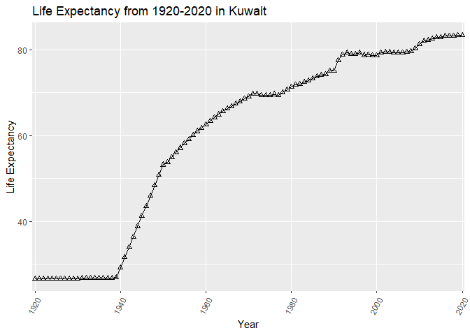
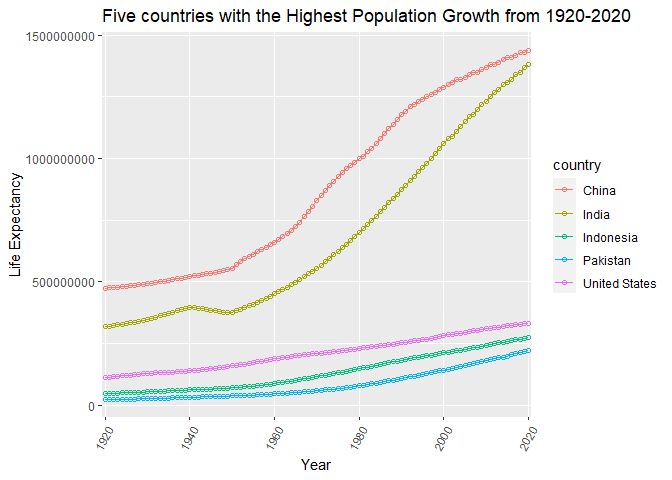
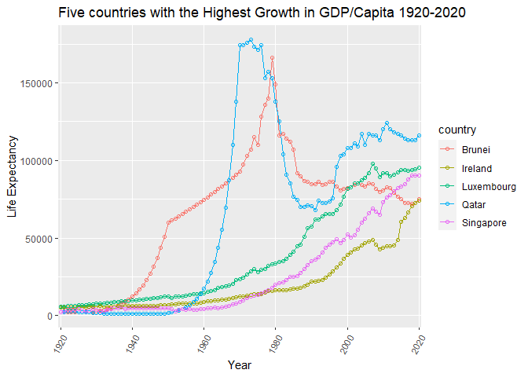
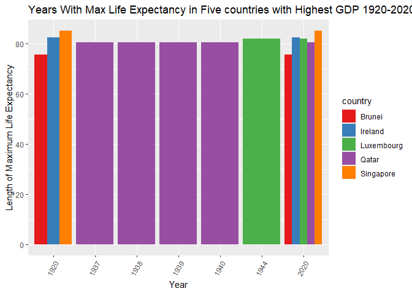
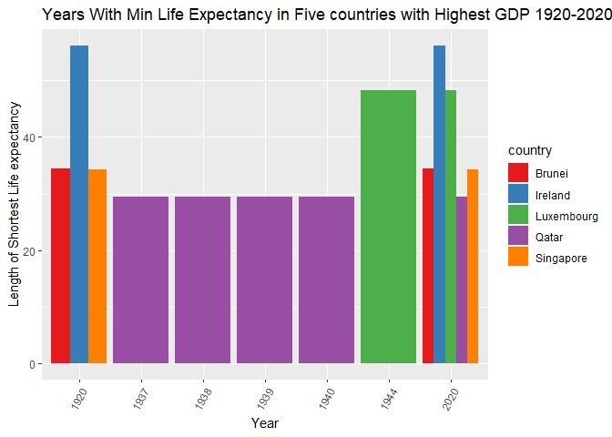

## Instructions
Answer the following questions and complete the exercises in RMarkdown. Please embed all of your code and push your final work to your repository. Your code should be organized, clean, and run free from errors. Be sure to **add your name** to the author header above. You may use any resources to answer these questions (including each other), but you may not post questions to Open Stacks or external help sites. There are 10 total questions.  

Make sure to use the formatting conventions of RMarkdown to make your report neat and clean! Your plots should use consistent aesthetics throughout. Feel free to be creative- there are many possible solutions to these questions!  

This exam is due by **12:00p on Tuesday, February 23**.  

## Load the libraries

```r
library(tidyverse)
```

```
## -- Attaching packages --------------------------------------- tidyverse 1.3.0 --
```

```
## √ ggplot2 3.3.3     √ purrr   0.3.4
## √ tibble  3.0.6     √ dplyr   1.0.4
## √ tidyr   1.1.2     √ stringr 1.4.0
## √ readr   1.4.0     √ forcats 0.5.1
```

```
## -- Conflicts ------------------------------------------ tidyverse_conflicts() --
## x dplyr::filter() masks stats::filter()
## x dplyr::lag()    masks stats::lag()
```

```r
library(janitor)
```

```
## 
## Attaching package: 'janitor'
```

```
## The following objects are masked from 'package:stats':
## 
##     chisq.test, fisher.test
```

```r
library(here)
```

```
## here() starts at D:/TA files/Winter2021 BIS15L/students_rep/BIS15W2021_ecoyle
```

```r
options(scipen=999) #disables scientific notation when printing
```

## Gapminder
For this assignment, we are going to use data from  [gapminder](https://www.gapminder.org/). Gapminder includes information about economics, population, social issues, and life expectancy from countries all over the world. We will use three data sets, so please load all three.  

One thing to note is that the data include years beyond 2021. These are projections based on modeling done by the gapminder organization. Start by importing the data.

```r
population <- read_csv(here("midterm2","data", "population_total.csv"))
```

```
## 
## -- Column specification --------------------------------------------------------
## cols(
##   .default = col_double(),
##   country = col_character()
## )
## i Use `spec()` for the full column specifications.
```

```r
population
```

```
## # A tibble: 195 x 302
##    country `1800` `1801` `1802` `1803` `1804` `1805` `1806` `1807` `1808` `1809`
##    <chr>    <dbl>  <dbl>  <dbl>  <dbl>  <dbl>  <dbl>  <dbl>  <dbl>  <dbl>  <dbl>
##  1 Afghan~ 3.28e6 3.28e6 3.28e6 3.28e6 3.28e6 3.28e6 3.28e6 3.28e6 3.28e6 3.28e6
##  2 Albania 4.00e5 4.02e5 4.04e5 4.05e5 4.07e5 4.09e5 4.11e5 4.13e5 4.14e5 4.16e5
##  3 Algeria 2.50e6 2.51e6 2.52e6 2.53e6 2.54e6 2.55e6 2.56e6 2.56e6 2.57e6 2.58e6
##  4 Andorra 2.65e3 2.65e3 2.65e3 2.65e3 2.65e3 2.65e3 2.65e3 2.65e3 2.65e3 2.65e3
##  5 Angola  1.57e6 1.57e6 1.57e6 1.57e6 1.57e6 1.57e6 1.57e6 1.57e6 1.57e6 1.57e6
##  6 Antigu~ 3.70e4 3.70e4 3.70e4 3.70e4 3.70e4 3.70e4 3.70e4 3.70e4 3.70e4 3.70e4
##  7 Argent~ 5.34e5 5.20e5 5.06e5 4.92e5 4.79e5 4.66e5 4.53e5 4.41e5 4.29e5 4.17e5
##  8 Armenia 4.13e5 4.13e5 4.13e5 4.13e5 4.13e5 4.13e5 4.13e5 4.13e5 4.13e5 4.13e5
##  9 Austra~ 2.00e5 2.05e5 2.11e5 2.16e5 2.22e5 2.27e5 2.33e5 2.39e5 2.46e5 2.52e5
## 10 Austria 3.00e6 3.02e6 3.04e6 3.05e6 3.07e6 3.09e6 3.11e6 3.12e6 3.14e6 3.16e6
## # ... with 185 more rows, and 291 more variables: 1810 <dbl>, 1811 <dbl>,
## #   1812 <dbl>, 1813 <dbl>, 1814 <dbl>, 1815 <dbl>, 1816 <dbl>, 1817 <dbl>,
## #   1818 <dbl>, 1819 <dbl>, 1820 <dbl>, 1821 <dbl>, 1822 <dbl>, 1823 <dbl>,
## #   1824 <dbl>, 1825 <dbl>, 1826 <dbl>, 1827 <dbl>, 1828 <dbl>, 1829 <dbl>,
## #   1830 <dbl>, 1831 <dbl>, 1832 <dbl>, 1833 <dbl>, 1834 <dbl>, 1835 <dbl>,
## #   1836 <dbl>, 1837 <dbl>, 1838 <dbl>, 1839 <dbl>, 1840 <dbl>, 1841 <dbl>,
## #   1842 <dbl>, 1843 <dbl>, 1844 <dbl>, 1845 <dbl>, 1846 <dbl>, 1847 <dbl>,
## #   1848 <dbl>, 1849 <dbl>, 1850 <dbl>, 1851 <dbl>, 1852 <dbl>, 1853 <dbl>,
## #   1854 <dbl>, 1855 <dbl>, 1856 <dbl>, 1857 <dbl>, 1858 <dbl>, 1859 <dbl>,
## #   1860 <dbl>, 1861 <dbl>, 1862 <dbl>, 1863 <dbl>, 1864 <dbl>, 1865 <dbl>,
## #   1866 <dbl>, 1867 <dbl>, 1868 <dbl>, 1869 <dbl>, 1870 <dbl>, 1871 <dbl>,
## #   1872 <dbl>, 1873 <dbl>, 1874 <dbl>, 1875 <dbl>, 1876 <dbl>, 1877 <dbl>,
## #   1878 <dbl>, 1879 <dbl>, 1880 <dbl>, 1881 <dbl>, 1882 <dbl>, 1883 <dbl>,
## #   1884 <dbl>, 1885 <dbl>, 1886 <dbl>, 1887 <dbl>, 1888 <dbl>, 1889 <dbl>,
## #   1890 <dbl>, 1891 <dbl>, 1892 <dbl>, 1893 <dbl>, 1894 <dbl>, 1895 <dbl>,
## #   1896 <dbl>, 1897 <dbl>, 1898 <dbl>, 1899 <dbl>, 1900 <dbl>, 1901 <dbl>,
## #   1902 <dbl>, 1903 <dbl>, 1904 <dbl>, 1905 <dbl>, 1906 <dbl>, 1907 <dbl>,
## #   1908 <dbl>, 1909 <dbl>, ...
```


```r
income <- read_csv(here("midterm2","data", "income_per_person_gdppercapita_ppp_inflation_adjusted.csv"))
```

```
## 
## -- Column specification --------------------------------------------------------
## cols(
##   .default = col_double(),
##   country = col_character()
## )
## i Use `spec()` for the full column specifications.
```

```r
income
```

```
## # A tibble: 193 x 242
##    country `1800` `1801` `1802` `1803` `1804` `1805` `1806` `1807` `1808` `1809`
##    <chr>    <dbl>  <dbl>  <dbl>  <dbl>  <dbl>  <dbl>  <dbl>  <dbl>  <dbl>  <dbl>
##  1 Afghan~    603    603    603    603    603    603    603    603    603    603
##  2 Albania    667    667    667    667    667    668    668    668    668    668
##  3 Algeria    715    716    717    718    719    720    721    722    723    724
##  4 Andorra   1200   1200   1200   1200   1210   1210   1210   1210   1220   1220
##  5 Angola     618    620    623    626    628    631    634    637    640    642
##  6 Antigu~    757    757    757    757    757    757    757    758    758    758
##  7 Argent~   1640   1640   1650   1650   1660   1660   1670   1680   1680   1690
##  8 Armenia    514    514    514    514    514    514    514    514    514    514
##  9 Austra~    817    822    826    831    836    841    845    850    855    860
## 10 Austria   1850   1850   1860   1870   1880   1880   1890   1900   1910   1920
## # ... with 183 more rows, and 231 more variables: 1810 <dbl>, 1811 <dbl>,
## #   1812 <dbl>, 1813 <dbl>, 1814 <dbl>, 1815 <dbl>, 1816 <dbl>, 1817 <dbl>,
## #   1818 <dbl>, 1819 <dbl>, 1820 <dbl>, 1821 <dbl>, 1822 <dbl>, 1823 <dbl>,
## #   1824 <dbl>, 1825 <dbl>, 1826 <dbl>, 1827 <dbl>, 1828 <dbl>, 1829 <dbl>,
## #   1830 <dbl>, 1831 <dbl>, 1832 <dbl>, 1833 <dbl>, 1834 <dbl>, 1835 <dbl>,
## #   1836 <dbl>, 1837 <dbl>, 1838 <dbl>, 1839 <dbl>, 1840 <dbl>, 1841 <dbl>,
## #   1842 <dbl>, 1843 <dbl>, 1844 <dbl>, 1845 <dbl>, 1846 <dbl>, 1847 <dbl>,
## #   1848 <dbl>, 1849 <dbl>, 1850 <dbl>, 1851 <dbl>, 1852 <dbl>, 1853 <dbl>,
## #   1854 <dbl>, 1855 <dbl>, 1856 <dbl>, 1857 <dbl>, 1858 <dbl>, 1859 <dbl>,
## #   1860 <dbl>, 1861 <dbl>, 1862 <dbl>, 1863 <dbl>, 1864 <dbl>, 1865 <dbl>,
## #   1866 <dbl>, 1867 <dbl>, 1868 <dbl>, 1869 <dbl>, 1870 <dbl>, 1871 <dbl>,
## #   1872 <dbl>, 1873 <dbl>, 1874 <dbl>, 1875 <dbl>, 1876 <dbl>, 1877 <dbl>,
## #   1878 <dbl>, 1879 <dbl>, 1880 <dbl>, 1881 <dbl>, 1882 <dbl>, 1883 <dbl>,
## #   1884 <dbl>, 1885 <dbl>, 1886 <dbl>, 1887 <dbl>, 1888 <dbl>, 1889 <dbl>,
## #   1890 <dbl>, 1891 <dbl>, 1892 <dbl>, 1893 <dbl>, 1894 <dbl>, 1895 <dbl>,
## #   1896 <dbl>, 1897 <dbl>, 1898 <dbl>, 1899 <dbl>, 1900 <dbl>, 1901 <dbl>,
## #   1902 <dbl>, 1903 <dbl>, 1904 <dbl>, 1905 <dbl>, 1906 <dbl>, 1907 <dbl>,
## #   1908 <dbl>, 1909 <dbl>, ...
```


```r
life_expectancy <- read_csv(here("midterm2","data", "life_expectancy_years.csv"))
```

```
## 
## -- Column specification --------------------------------------------------------
## cols(
##   .default = col_double(),
##   country = col_character()
## )
## i Use `spec()` for the full column specifications.
```

```r
life_expectancy
```

```
## # A tibble: 187 x 302
##    country `1800` `1801` `1802` `1803` `1804` `1805` `1806` `1807` `1808` `1809`
##    <chr>    <dbl>  <dbl>  <dbl>  <dbl>  <dbl>  <dbl>  <dbl>  <dbl>  <dbl>  <dbl>
##  1 Afghan~   28.2   28.2   28.2   28.2   28.2   28.2   28.1   28.1   28.1   28.1
##  2 Albania   35.4   35.4   35.4   35.4   35.4   35.4   35.4   35.4   35.4   35.4
##  3 Algeria   28.8   28.8   28.8   28.8   28.8   28.8   28.8   28.8   28.8   28.8
##  4 Andorra   NA     NA     NA     NA     NA     NA     NA     NA     NA     NA  
##  5 Angola    27     27     27     27     27     27     27     27     27     27  
##  6 Antigu~   33.5   33.5   33.5   33.5   33.5   33.5   33.5   33.5   33.5   33.5
##  7 Argent~   33.2   33.2   33.2   33.2   33.2   33.2   33.2   33.2   33.2   33.2
##  8 Armenia   34     34     34     34     34     34     34     34     34     34  
##  9 Austra~   34     34     34     34     34     34     34     34     34     34  
## 10 Austria   34.4   34.4   34.4   34.4   34.4   34.4   34.4   34.4   34.4   34.4
## # ... with 177 more rows, and 291 more variables: 1810 <dbl>, 1811 <dbl>,
## #   1812 <dbl>, 1813 <dbl>, 1814 <dbl>, 1815 <dbl>, 1816 <dbl>, 1817 <dbl>,
## #   1818 <dbl>, 1819 <dbl>, 1820 <dbl>, 1821 <dbl>, 1822 <dbl>, 1823 <dbl>,
## #   1824 <dbl>, 1825 <dbl>, 1826 <dbl>, 1827 <dbl>, 1828 <dbl>, 1829 <dbl>,
## #   1830 <dbl>, 1831 <dbl>, 1832 <dbl>, 1833 <dbl>, 1834 <dbl>, 1835 <dbl>,
## #   1836 <dbl>, 1837 <dbl>, 1838 <dbl>, 1839 <dbl>, 1840 <dbl>, 1841 <dbl>,
## #   1842 <dbl>, 1843 <dbl>, 1844 <dbl>, 1845 <dbl>, 1846 <dbl>, 1847 <dbl>,
## #   1848 <dbl>, 1849 <dbl>, 1850 <dbl>, 1851 <dbl>, 1852 <dbl>, 1853 <dbl>,
## #   1854 <dbl>, 1855 <dbl>, 1856 <dbl>, 1857 <dbl>, 1858 <dbl>, 1859 <dbl>,
## #   1860 <dbl>, 1861 <dbl>, 1862 <dbl>, 1863 <dbl>, 1864 <dbl>, 1865 <dbl>,
## #   1866 <dbl>, 1867 <dbl>, 1868 <dbl>, 1869 <dbl>, 1870 <dbl>, 1871 <dbl>,
## #   1872 <dbl>, 1873 <dbl>, 1874 <dbl>, 1875 <dbl>, 1876 <dbl>, 1877 <dbl>,
## #   1878 <dbl>, 1879 <dbl>, 1880 <dbl>, 1881 <dbl>, 1882 <dbl>, 1883 <dbl>,
## #   1884 <dbl>, 1885 <dbl>, 1886 <dbl>, 1887 <dbl>, 1888 <dbl>, 1889 <dbl>,
## #   1890 <dbl>, 1891 <dbl>, 1892 <dbl>, 1893 <dbl>, 1894 <dbl>, 1895 <dbl>,
## #   1896 <dbl>, 1897 <dbl>, 1898 <dbl>, 1899 <dbl>, 1900 <dbl>, 1901 <dbl>,
## #   1902 <dbl>, 1903 <dbl>, 1904 <dbl>, 1905 <dbl>, 1906 <dbl>, 1907 <dbl>,
## #   1908 <dbl>, 1909 <dbl>, ...
```


```r
#glimpse(population)
#glimpse(income)
#glimpse(life_expectancy)
```

1. (3 points) Once you have an idea of the structure of the data, please make each data set tidy and store them as new objects. You will need both the original and tidy data!

```r
population_tidy<-population%>%
  pivot_longer(-country,names_to = "year",values_to = "population")
population_tidy
```

```
## # A tibble: 58,695 x 3
##    country     year  population
##    <chr>       <chr>      <dbl>
##  1 Afghanistan 1800     3280000
##  2 Afghanistan 1801     3280000
##  3 Afghanistan 1802     3280000
##  4 Afghanistan 1803     3280000
##  5 Afghanistan 1804     3280000
##  6 Afghanistan 1805     3280000
##  7 Afghanistan 1806     3280000
##  8 Afghanistan 1807     3280000
##  9 Afghanistan 1808     3280000
## 10 Afghanistan 1809     3280000
## # ... with 58,685 more rows
```


```r
income_tidy<-income%>%
  pivot_longer(-country,names_to = "year",values_to = "income")
income_tidy
```

```
## # A tibble: 46,513 x 3
##    country     year  income
##    <chr>       <chr>  <dbl>
##  1 Afghanistan 1800     603
##  2 Afghanistan 1801     603
##  3 Afghanistan 1802     603
##  4 Afghanistan 1803     603
##  5 Afghanistan 1804     603
##  6 Afghanistan 1805     603
##  7 Afghanistan 1806     603
##  8 Afghanistan 1807     603
##  9 Afghanistan 1808     603
## 10 Afghanistan 1809     603
## # ... with 46,503 more rows
```


```r
life_expectancy_tidy<-life_expectancy%>%
  pivot_longer(-country,names_to = "year",values_to = "life_expectancy")
life_expectancy_tidy
```

```
## # A tibble: 56,287 x 3
##    country     year  life_expectancy
##    <chr>       <chr>           <dbl>
##  1 Afghanistan 1800             28.2
##  2 Afghanistan 1801             28.2
##  3 Afghanistan 1802             28.2
##  4 Afghanistan 1803             28.2
##  5 Afghanistan 1804             28.2
##  6 Afghanistan 1805             28.2
##  7 Afghanistan 1806             28.1
##  8 Afghanistan 1807             28.1
##  9 Afghanistan 1808             28.1
## 10 Afghanistan 1809             28.1
## # ... with 56,277 more rows
```

```r
summary(income_tidy)
```

```
##    country              year               income      
##  Length:46513       Length:46513       Min.   :   245  
##  Class :character   Class :character   1st Qu.:   899  
##  Mode  :character   Mode  :character   Median :  1750  
##                                        Mean   :  6429  
##                                        3rd Qu.:  4830  
##                                        Max.   :179000
```

```r
summary(life_expectancy_tidy)
```

```
##    country              year           life_expectancy
##  Length:56287       Length:56287       Min.   : 1.01  
##  Class :character   Class :character   1st Qu.:32.30  
##  Mode  :character   Mode  :character   Median :48.70  
##                                        Mean   :53.04  
##                                        3rd Qu.:74.20  
##                                        Max.   :94.80  
##                                        NA's   :759
```

```r
summary(population_tidy)
```

```
##    country              year             population        
##  Length:58695       Length:58695       Min.   :       645  
##  Class :character   Class :character   1st Qu.:    422000  
##  Mode  :character   Mode  :character   Median :   2610000  
##                                        Mean   :  23285253  
##                                        3rd Qu.:  10800000  
##                                        Max.   :1650000000
```

```r
life_expectancy_tidy%>%
  arrange(`life_expectancy`)
```

```
## # A tibble: 56,287 x 3
##    country    year  life_expectancy
##    <chr>      <chr>           <dbl>
##  1 Fiji       1875             1.01
##  2 Samoa      1918             1.1 
##  3 Tunisia    1819             1.5 
##  4 Ethiopia   1890             4   
##  5 Mauritius  1867             4   
##  6 Kazakhstan 1933             4.07
##  7 Ethiopia   1889             5   
##  8 Namibia    1904             5.19
##  9 Tunisia    1818             5.5 
## 10 Cameroon   1918             5.95
## # ... with 56,277 more rows
```

2. (1 point) How many different countries are represented in the data? Provide the total number and their names. Since each data set includes different numbers of countries, you will need to do this for each one.

```r
population_tidy%>%
  group_by(country)%>%
  summarise(total_years_of_data=n())
```

```
## # A tibble: 195 x 2
##    country             total_years_of_data
##  * <chr>                             <int>
##  1 Afghanistan                         301
##  2 Albania                             301
##  3 Algeria                             301
##  4 Andorra                             301
##  5 Angola                              301
##  6 Antigua and Barbuda                 301
##  7 Argentina                           301
##  8 Armenia                             301
##  9 Australia                           301
## 10 Austria                             301
## # ... with 185 more rows
```
#195 different countries in the population data

```r
income_tidy%>%
  group_by(country)%>%
  summarise(total_years_of_data=n())
```

```
## # A tibble: 193 x 2
##    country             total_years_of_data
##  * <chr>                             <int>
##  1 Afghanistan                         241
##  2 Albania                             241
##  3 Algeria                             241
##  4 Andorra                             241
##  5 Angola                              241
##  6 Antigua and Barbuda                 241
##  7 Argentina                           241
##  8 Armenia                             241
##  9 Australia                           241
## 10 Austria                             241
## # ... with 183 more rows
```
#193 countries in the income data

```r
life_expectancy_tidy%>%
  group_by(country)%>%
  summarise(total_years_of_data=n())
```

```
## # A tibble: 187 x 2
##    country             total_years_of_data
##  * <chr>                             <int>
##  1 Afghanistan                         301
##  2 Albania                             301
##  3 Algeria                             301
##  4 Andorra                             301
##  5 Angola                              301
##  6 Antigua and Barbuda                 301
##  7 Argentina                           301
##  8 Armenia                             301
##  9 Australia                           301
## 10 Austria                             301
## # ... with 177 more rows
```
#187 countries in the life expectancy data

## Life Expectancy  

3. (2 points) Let's limit the data to the past 100 years (1920-2020). For these years, which country has the highest life expectancy? How about the lowest life expectancy?  

Highest

```r
life_expectancy_tidy%>%
  group_by(country)%>%
  filter(year<=2020&year>=1920)%>%
  arrange(desc(life_expectancy))
```

```
## # A tibble: 18,887 x 3
## # Groups:   country [187]
##    country     year  life_expectancy
##    <chr>       <chr>           <dbl>
##  1 Singapore   2020             85.3
##  2 Singapore   2019             85.1
##  3 Singapore   2018             85  
##  4 Singapore   2017             84.8
##  5 Japan       2020             84.7
##  6 Singapore   2016             84.7
##  7 Japan       2019             84.5
##  8 Japan       2018             84.4
##  9 Singapore   2015             84.4
## 10 Switzerland 2020             84.4
## # ... with 18,877 more rows
```
#highest individual life expectacy during this span was in Singapore in 2020 at 85.3 years


```r
life_expectancy_tidy%>%
  group_by(country)%>%
  filter(year<=2020&year>=1920)%>%
  summarise(mean_life_expectancy=mean(life_expectancy,na.rm=T))%>%
  arrange(desc(mean_life_expectancy))
```

```
## # A tibble: 187 x 2
##    country     mean_life_expectancy
##    <chr>                      <dbl>
##  1 Andorra                     79.8
##  2 Sweden                      73.5
##  3 Norway                      73.2
##  4 Netherlands                 73.0
##  5 Dominica                    73.0
##  6 Iceland                     72.9
##  7 Australia                   72.7
##  8 Switzerland                 72.7
##  9 Denmark                     71.9
## 10 Canada                      71.8
## # ... with 177 more rows
```
#highest mean life expectancy over these 100 years was Andorra

```r
life_expectancy_tidy%>%
  filter(country=="Andorra")
```

```
## # A tibble: 301 x 3
##    country year  life_expectancy
##    <chr>   <chr>           <dbl>
##  1 Andorra 1800               NA
##  2 Andorra 1801               NA
##  3 Andorra 1802               NA
##  4 Andorra 1803               NA
##  5 Andorra 1804               NA
##  6 Andorra 1805               NA
##  7 Andorra 1806               NA
##  8 Andorra 1807               NA
##  9 Andorra 1808               NA
## 10 Andorra 1809               NA
## # ... with 291 more rows
```
#Andorra is highest when NA's are removed becuase it is a recent country (1970 is when data begins), so if NAs are not removed the highest life expectancy over the 100 year span is in Sweden
#I decided to leave NA's in to not bias data

Lowest

```r
life_expectancy_tidy%>%
  group_by(country)%>%
  filter(year<=2020&year>=1920)%>%
  arrange(life_expectancy)
```

```
## # A tibble: 18,887 x 3
## # Groups:   country [187]
##    country         year  life_expectancy
##    <chr>           <chr>           <dbl>
##  1 Kazakhstan      1933             4.07
##  2 Kazakhstan      1932             8.15
##  3 Ukraine         1933             8.94
##  4 Rwanda          1994             9.64
##  5 Pakistan        1947            11.1 
##  6 Kyrgyz Republic 1921            11.9 
##  7 Lithuania       1941            12   
##  8 Belarus         1943            13.9 
##  9 Kyrgyz Republic 1922            13.9 
## 10 Turkmenistan    1933            14.2 
## # ... with 18,877 more rows
```

```r
life_expectancy_tidy%>%
  group_by(country)%>%
  filter(year<=2020&year>=1920)%>%
  summarise(mean_life_expectancy=mean(life_expectancy,na.rm=T))%>%
  arrange((mean_life_expectancy))
```

```
## # A tibble: 187 x 2
##    country                  mean_life_expectancy
##    <chr>                                   <dbl>
##  1 Central African Republic                 41.8
##  2 Mali                                     41.8
##  3 Ethiopia                                 42.6
##  4 Sierra Leone                             42.6
##  5 Guinea-Bissau                            42.6
##  6 Burundi                                  42.8
##  7 Malawi                                   42.8
##  8 Uganda                                   43.3
##  9 Eritrea                                  43.4
## 10 Yemen                                    43.6
## # ... with 177 more rows
```
#lowest single year life expectancy was in Kazakhstan in 1933- 4.07 years! and Lowest average life expectancy over the 100 year period was the Central African Republic with 41.76634 years

4. (3 points) Although we can see which country has the highest life expectancy for the past 100 years, we don't know which countries have changed the most. What are the top 5 countries that have experienced the biggest improvement in life expectancy between 1920-2020?

```r
life_expectancy_tidy%>%
  group_by(country)%>%
  filter(year==2020|year==1920)%>%
  mutate(Life_expectancy_growth = life_expectancy- lag(life_expectancy, default = first(life_expectancy)))%>%
  arrange(desc(Life_expectancy_growth))
```

```
## # A tibble: 374 x 4
## # Groups:   country [187]
##    country         year  life_expectancy Life_expectancy_growth
##    <chr>           <chr>           <dbl>                  <dbl>
##  1 Kuwait          2020             83.4                   56.8
##  2 Kyrgyz Republic 2020             73.1                   56.5
##  3 Turkmenistan    2020             70.5                   55.3
##  4 South Korea     2020             83.2                   55  
##  5 Tajikistan      2020             71                     54.3
##  6 Nicaragua       2020             79.5                   54.2
##  7 Kazakhstan      2020             73.1                   53.8
##  8 Russia          2020             72.7                   52.2
##  9 Israel          2020             83.4                   51.4
## 10 Iran            2020             78                     51.2
## # ... with 364 more rows
```
#top five are Kuwait, Kyrgyz Republic, Turkmenistan, South Korea, and Tajikistan


```r
life_expectancy_tidy%>%
  group_by(country)%>%
  filter(year==2020|year==1920)%>%
  mutate(Life_expectancy_growth = life_expectancy- lag(life_expectancy, default = first(life_expectancy)))%>%
  arrange(desc(Life_expectancy_growth))%>%
  filter(Life_expectancy_growth>54.2)
```

```
## # A tibble: 5 x 4
## # Groups:   country [5]
##   country         year  life_expectancy Life_expectancy_growth
##   <chr>           <chr>           <dbl>                  <dbl>
## 1 Kuwait          2020             83.4                   56.8
## 2 Kyrgyz Republic 2020             73.1                   56.5
## 3 Turkmenistan    2020             70.5                   55.3
## 4 South Korea     2020             83.2                   55  
## 5 Tajikistan      2020             71                     54.3
```


```r
life_expectancy_tidy%>%
  group_by(country)%>%
  filter(year==2020|year==1920)%>%
  mutate(Life_expectancy_growth = life_expectancy- lag(life_expectancy, default = first(life_expectancy)))%>%
  arrange(desc(Life_expectancy_growth))%>%
  filter(Life_expectancy_growth>54.2)%>%
  ggplot(aes(x=country,y=Life_expectancy_growth,fill=country))+
  geom_col()+
  scale_fill_brewer(palette = "Set1")+
  theme(axis.text.x = element_text(angle = 60, hjust = 1))+
  labs(title = "Five countries with the most improvement in Life Expectancy from 1920-2020",x="Country",y="Improvement in Life Expectancy")
```

<!-- -->
<style>
div.blue { background-color:#e6f0ff; border-radius: 5px; padding: 20px;}
</style>
<div class = "blue">

5. (3 points) Make a plot that shows the change over the past 100 years for the country with the biggest improvement in life expectancy. Be sure to add appropriate aesthetics to make the plot clean and clear. Once you have made the plot, do a little internet searching and see if you can discover what historical event may have contributed to this remarkable change.  

```r
life_expectancy_tidy_1920_2020<-life_expectancy_tidy%>%
  filter(year<=2020&year>=1920)
```


```r
life_expectancy_tidy_1920_2020$year<-as.factor(life_expectancy_tidy_1920_2020$year)
```


```r
life_expectancy_tidy_1920_2020%>%
  filter(country=="Kuwait")%>%
  ggplot(aes(x=year,y=life_expectancy,group=1))+
  geom_line()+
  geom_point(shape=2)+
  scale_fill_brewer(palette = "Set1")+
  theme(axis.text.x = element_text(angle = 60, hjust = 1))+
  scale_x_discrete(breaks=c(1920,1940,1960,1980,2000,2020))+
  labs(title = "Life Expectancy from 1920-2020 in Kuwait",x="Year",y="Life Expectancy")
```

<!-- -->
</div>


## Population Growth
6. (3 points) Which 5 countries have had the highest population growth over the past 100 years (1920-2020)?

```r
population_tidy%>%
  group_by(country)%>%
  filter(year==2020|year==1920)%>%
  mutate(population_growth = population- lag(population, default = first(population)))%>%
  arrange(desc(population_growth))
```

```
## # A tibble: 390 x 4
## # Groups:   country [195]
##    country       year  population population_growth
##    <chr>         <chr>      <dbl>             <dbl>
##  1 India         2020  1380000000        1063000000
##  2 China         2020  1440000000         968000000
##  3 Indonesia     2020   274000000         226700000
##  4 United States 2020   331000000         220000000
##  5 Pakistan      2020   221000000         199300000
##  6 Brazil        2020   213000000         185400000
##  7 Nigeria       2020   206000000         182700000
##  8 Bangladesh    2020   165000000         137700000
##  9 Mexico        2020   129000000         114200000
## 10 Philippines   2020   110000000         100600000
## # ... with 380 more rows
```

```r
population_tidy%>%
  group_by(country)%>%
  filter(year==2020|year==1920)%>%
  mutate(population_growth = population- lag(population, default = first(population)))%>%
  arrange(desc(population_growth))%>%
  filter(population_growth>185400000)
```

```
## # A tibble: 5 x 4
## # Groups:   country [5]
##   country       year  population population_growth
##   <chr>         <chr>      <dbl>             <dbl>
## 1 India         2020  1380000000        1063000000
## 2 China         2020  1440000000         968000000
## 3 Indonesia     2020   274000000         226700000
## 4 United States 2020   331000000         220000000
## 5 Pakistan      2020   221000000         199300000
```

7. (4 points) Produce a plot that shows the 5 countries that have had the highest population growth over the past 100 years (1920-2020). Which countries appear to have had exponential growth?  

```r
population_tidy_1920_2020<-population_tidy%>%
  filter(year<=2020&year>=1920)
```


```r
population_tidy_1920_2020$year<-as.factor(population_tidy_1920_2020$year)
```


```r
population_tidy_1920_2020%>%
  filter(country=="China"|country=="India"|country=="Indonesia"|country=="United States"|country=="Pakistan")%>%
  ggplot(aes(x=year,y=population,group=country,color=country))+
  geom_line()+
  geom_point(shape=1)+
  scale_fill_brewer(palette = "Set1")+
  theme(axis.text.x = element_text(angle = 60, hjust = 1))+
  scale_x_discrete(breaks=c(1920,1940,1960,1980,2000,2020))+
  labs(title = "Five countries with the Highest Population Growth from 1920-2020",x="Year",y="Life Expectancy")
```

<!-- -->
#China and India have aproximately exponential growth for the 1920-2020 time frame

## Income
The units used for income are gross domestic product per person adjusted for differences in purchasing power in international dollars.

<style>
div.blue { background-color:#e6f0ff; border-radius: 5px; padding: 20px;}
</style>
<div class = "blue">

8. (4 points) As in the previous questions, which countries have experienced the biggest growth in per person GDP. Show this as a table and then plot the changes for the top 5 countries. With a bit of research, you should be able to explain the dramatic downturns of the wealthiest economies that occurred during the 1980's.

```r
income_tidy%>%
  group_by(country)%>%
  filter(year==2020|year==1920)%>%
  mutate(GDP_per_capita_growth = income- lag(income, default = first(income)))%>%
  arrange(desc(GDP_per_capita_growth))
```

```
## # A tibble: 386 x 4
## # Groups:   country [193]
##    country              year  income GDP_per_capita_growth
##    <chr>                <chr>  <dbl>                 <dbl>
##  1 Qatar                2020  116000                113700
##  2 Luxembourg           2020   95100                 89370
##  3 Singapore            2020   90500                 88060
##  4 Brunei               2020   75100                 72970
##  5 Ireland              2020   74100                 68930
##  6 United Arab Emirates 2020   65300                 63210
##  7 Kuwait               2020   64300                 61950
##  8 Norway               2020   67500                 58540
##  9 Monaco               2020   62000                 55370
## 10 San Marino           2020   57900                 54620
## # ... with 376 more rows
```

```r
income_tidy%>%
  group_by(country)%>%
  filter(year==2020|year==1920)%>%
  mutate(GDP_per_capita_growth = income- lag(income, default = first(income)))%>%
  filter(GDP_per_capita_growth>63210)%>%
  arrange(desc(GDP_per_capita_growth))
```

```
## # A tibble: 5 x 4
## # Groups:   country [5]
##   country    year  income GDP_per_capita_growth
##   <chr>      <chr>  <dbl>                 <dbl>
## 1 Qatar      2020  116000                113700
## 2 Luxembourg 2020   95100                 89370
## 3 Singapore  2020   90500                 88060
## 4 Brunei     2020   75100                 72970
## 5 Ireland    2020   74100                 68930
```

```r
income_tidy_1920_2020<-income_tidy%>%
  filter(year<=2020&year>=1920)
```


```r
income_tidy_1920_2020%>%
  filter(country=="Qatar"|country=="Luxembourg"|country=="Singapore"|country=="Brunei"|country=="Ireland")%>%
  ggplot(aes(x=year,y=income,group=country,color=country))+
  geom_line()+
  geom_point(shape=1)+
  scale_fill_brewer(palette = "Set1")+
  theme(axis.text.x = element_text(angle = 60, hjust = 1))+
  scale_x_discrete(breaks=c(1920,1940,1960,1980,2000,2020))+
  labs(title = "Five countries with the Highest Growth in GDP/Capita 1920-2020",x="Year",y="Life Expectancy")
```

<!-- -->
</div>

9. (3 points) Create three new objects that restrict each data set (life expectancy, population, income) to the years 1920-2020. Hint: I suggest doing this with the long form of your data. Once this is done, merge all three data sets using the code I provide below. You may need to adjust the code depending on how you have named your objects. I called mine `life_expectancy_100`, `population_100`, and `income_100`. For some of you, learning these `joins` will be important for your project.  

life_expectancy_100

```r
Life_expectancy_tidy_1920_2020<-life_expectancy_tidy%>%
  filter(year<=2020&year>=1920)
```

population_100

```r
population_tidy_1920_2020<-population_tidy%>%
  filter(year<=2020&year>=1920)
```

income_tidy_1920_2020

```r
income_tidy_1920_2020<-income_tidy%>%
  filter(year<=2020&year>=1920)
```


```r
gapminder_join <- inner_join(life_expectancy_tidy_1920_2020, population_tidy_1920_2020, by= c("country", "year"))
gapminder_join <- inner_join(gapminder_join, income_tidy_1920_2020, by= c("country", "year"))
gapminder_join
```

```
## # A tibble: 18,887 x 5
##    country     year  life_expectancy population income
##    <chr>       <chr>           <dbl>      <dbl>  <dbl>
##  1 Afghanistan 1920             30.6   10600000   1490
##  2 Afghanistan 1921             30.7   10500000   1520
##  3 Afghanistan 1922             30.8   10300000   1550
##  4 Afghanistan 1923             30.8    9710000   1570
##  5 Afghanistan 1924             30.9    9200000   1600
##  6 Afghanistan 1925             31      8720000   1630
##  7 Afghanistan 1926             31      8260000   1650
##  8 Afghanistan 1927             31.1    7830000   1680
##  9 Afghanistan 1928             31.1    7420000   1710
## 10 Afghanistan 1929             31.2    7100000   1740
## # ... with 18,877 more rows
```

10. (4 points) Use the joined data to perform an analysis of your choice. The analysis should include a comparison between two or more of the variables `life_expectancy`, `population`, or `income.`

```r
gapminder_join%>%
  group_by(country)%>%
  mutate(maxlife=max(life_expectancy),minlife=min(life_expectancy))%>%
  filter(life_expectancy==maxlife|life_expectancy==minlife)
```

```
## # A tibble: 583 x 7
## # Groups:   country [184]
##    country             year  life_expectancy population income maxlife minlife
##    <chr>               <chr>           <dbl>      <dbl>  <dbl>   <dbl>   <dbl>
##  1 Afghanistan         1920             30.6   10600000   1490    64.4    30.6
##  2 Afghanistan         2020             64.4   38900000   1800    64.4    30.6
##  3 Albania             1944             34      1160000   1750    78.6    34  
##  4 Albania             2020             78.6    2880000  13200    78.6    34  
##  5 Algeria             1927             28.8    6190000   2780    78.3    28.8
##  6 Algeria             2020             78.3   43900000  14000    78.3    28.8
##  7 Angola              1920             30.4    2880000   1250    65.4    30.4
##  8 Angola              2020             65.4   32900000   5440    65.4    30.4
##  9 Antigua and Barbuda 1920             33.9      29800   1680    77.4    33.9
## 10 Antigua and Barbuda 1921             33.9      29800   1730    77.4    33.9
## # ... with 573 more rows
```


```r
gapminder_join%>%
  group_by(country)%>%
  mutate(maxlife=max(life_expectancy),minlife=min(life_expectancy))%>%
  mutate(max_difference=maxlife-minlife)%>%
  filter(life_expectancy==maxlife|life_expectancy==minlife)%>%
  filter(country=="Qatar"|country=="Luxembourg"|country=="Singapore"|country=="Brunei"|country=="Ireland")
```

```
## # A tibble: 13 x 8
## # Groups:   country [5]
##    country    year  life_expectancy population income maxlife minlife
##    <chr>      <chr>           <dbl>      <dbl>  <dbl>   <dbl>   <dbl>
##  1 Brunei     1920             34.4      26800   2130    75.8    34.4
##  2 Brunei     2020             75.8     437000  75100    75.8    34.4
##  3 Ireland    1920             56.2    4200000   5170    82.5    56.2
##  4 Ireland    2020             82.5    4940000  74100    82.5    56.2
##  5 Luxembourg 1944             48.2     298000  10800    82.1    48.2
##  6 Luxembourg 2020             82.1     626000  95100    82.1    48.2
##  7 Qatar      1937             29.5      21700   1110    80.6    29.5
##  8 Qatar      1938             29.5      21900   1110    80.6    29.5
##  9 Qatar      1939             29.5      22100   1100    80.6    29.5
## 10 Qatar      1940             29.5      22200   1090    80.6    29.5
## 11 Qatar      2020             80.6    2880000 116000    80.6    29.5
## 12 Singapore  1920             34.3     392000   2440    85.3    34.3
## 13 Singapore  2020             85.3    5850000  90500    85.3    34.3
## # ... with 1 more variable: max_difference <dbl>
```

```r
gapminder_join%>%
  group_by(country)%>%
  mutate(maxlife=max(life_expectancy),minlife=min(life_expectancy))%>%
  mutate(max_difference=maxlife-minlife)%>%
  filter(life_expectancy==maxlife|life_expectancy==minlife)%>%
  filter(country=="Qatar"|country=="Luxembourg"|country=="Singapore"|country=="Brunei"|country=="Ireland")%>%
  ggplot(aes(x=year,y=maxlife,fill=country))+
  geom_col(position = "dodge")+
  scale_fill_brewer(palette = "Set1")+
  theme(axis.text.x = element_text(angle = 60, hjust = 1))+
  labs(title = "Years With Max Life Expectancy in Five countries with Highest GDP 1920-2020",x="Year",y="Length of Maximum Life Expectancy")
```

<!-- -->

```r
gapminder_join%>%
  group_by(country)%>%
  mutate(maxlife=max(life_expectancy),minlife=min(life_expectancy))%>%
  mutate(max_difference=maxlife-minlife)%>%
  filter(life_expectancy==maxlife|life_expectancy==minlife)%>%
  filter(country=="Qatar"|country=="Luxembourg"|country=="Singapore"|country=="Brunei"|country=="Ireland")%>%
  ggplot(aes(x=year,y=minlife,fill=country))+
  geom_col(position = "dodge")+
  scale_fill_brewer(palette = "Set1")+
  theme(axis.text.x = element_text(angle = 60, hjust = 1))+
  labs(title = "Years With Min Life Expectancy in Five countries with Highest GDP 1920-2020",x="Year",y="Length of Shortest Life expectancy")
```

<!-- -->

